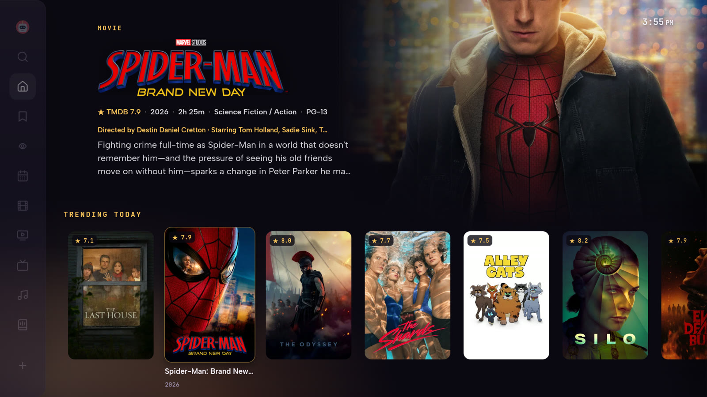
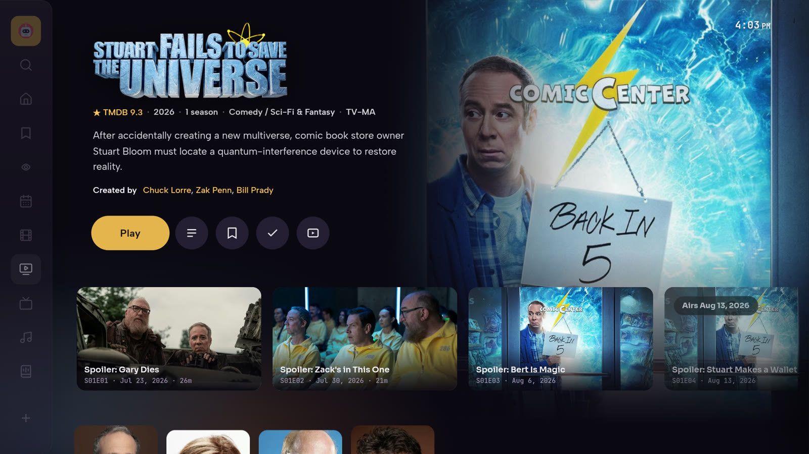
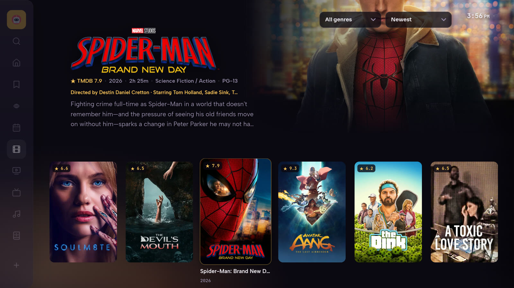

<p align="center">
  
</p>

<h1 align="center">Triboon</h1>

<p align="center">
  <strong>Press Play.</strong> Triboon finds a healthy source, mounts it, and starts streaming.<br>
  Self-hosted movies, shows, local libraries, music, subtitles, Trakt, and Live TV.
</p>

<p align="center">
  <a href="https://github.com/d1same/triboon/releases/latest"></a>
  <a href="LICENSE"></a>
  <a href="https://github.com/d1same/triboon/pkgs/container/triboon"></a>
  <a href="https://github.com/d1same/triboon/releases/latest/download/triboon.apk"></a>
</p>

<p align="center">
  <a href="#unraid">Unraid</a>
  ·
  <a href="#docker">Docker</a>
  ·
  <a href="https://github.com/d1same/triboon/releases/latest/download/triboon.apk">Android APK</a>
  ·
  <a href="https://github.com/d1same/triboon/releases/latest/download/Triboon-Windows-Client.exe">Windows client</a>
  ·
  <a href="https://github.com/d1same/triboon/releases/latest/download/Triboon-Windows-Server.exe">Windows server</a>
  ·
  <a href="docs-setup.md">Setup guide</a>
</p>

**Your keys stay on your server.** TMDB, usenet, indexer, IPTV, Trakt, and
subtitle credentials go into Settings. They are encrypted in `/data`. They are
not in this repo and not in the public Docker image.

Example: you paste a usenet password in the dashboard. GitHub never sees it.
The container image is just the app. Your Unraid `appdata` folder is the vault.

## Get Triboon

| How you host | How you watch |
|---|---|
| **[Unraid](#unraid)** — Community Apps / template | **Web** at `http://<server>:7777` |
| **[Docker](#docker)** — one `docker run` | **[Android](#android)** — one APK for TV, phone, and tablet |
| **[Windows server](#windows)** — one-click installer | **[Windows client](#windows)** — native libmpv player |

You only need three things to press Play: a free [TMDB](docs-setup.md) key, a
usenet provider, and one indexer. Subtitles, Trakt, Live TV, and music are
optional.

## Screenshots

Captured on the Android TV build against a demo library (TMDB artwork).

| Home | Detail |
|---|---|
|  |  |



## What It Does

Triboon is a Plex-polished, Stremio-style app you run yourself. The admin adds
providers and keys. Users sign in, pick a profile, browse, and press Play.

Playback prefers speed:

```text
source-fit -> direct play -> remux -> transcode
```

Detail pages can warm search and prepare the first viable source, so Play
reuses that mount instead of starting from zero.

- Movies and TV with TMDB metadata, seasons, watchlist, and Continue Watching.
- Best-source search across Newznab indexers, with health checks and failover.
- Usenet streaming from archives while they are still remote, with seeking.
- Local libraries for owned media.
- Live TV through M3U or Xtream playlists you already have.
- Wyzie / OpenSubtitles captions, Trakt, Music, Audiobooks, and multi-user
  profiles with invites and Quick Connect.

## Unraid

This is the usual home-server path.

1. Install from Community Apps, or add the
   [Unraid template](unraid/triboon.xml) with its
   [canonical raw URL](https://raw.githubusercontent.com/d1same/triboon/main/unraid/triboon.xml).
2. Use image `ghcr.io/d1same/triboon:latest`.
3. Map `/data` -> `/mnt/user/appdata/triboon`.
4. Open `http://<unraid-ip>:7777` and create the owner account.

Optional: map a media share to `/media` as read-only for local libraries.

Recommended environment:

- `PUID` and `PGID` for your Unraid user/group
- `UMASK`
- `TRIBOON_SECRET` is optional. When it is unset, Triboon generates a secret
  once and stores it in persistent `/data/secret.json`. If you provide one,
  keep it stable: changing or losing it invalidates signed sessions and makes
  the existing encrypted settings unreadable.
- `TRIBOON_WYZIE_KEY` optionally supplies the server-side Wyzie Subs key without
  storing it in the dashboard settings

Package details and versioned tags:
[public GitHub container page](https://github.com/d1same/triboon/pkgs/container/triboon).

## Docker

The public image supports `linux/amd64` and `linux/arm64`:

```bash
docker run -d --name triboon --restart unless-stopped -p 7777:7777 -v triboon-data:/data ghcr.io/d1same/triboon:latest
```

See the [public container package](https://github.com/d1same/triboon/pkgs/container/triboon)
for versioned image tags. The named volume is important: `/data` contains the
generated server secret and all persistent application state.

Open `http://localhost:7777`.

## First launch

Do this on the machine that just started, before any remote exposure:

1. Create the owner account immediately from a trusted LAN device.
2. Open Settings.
3. Add TMDB, usenet, and a Newznab-compatible indexer.
4. Optionally add a Wyzie key, OpenSubtitles, Trakt, local libraries, music, or
   Live TV.
5. Browse and press Play.

The first-owner setup route is intentionally open only while no users exist, so
do not expose port 7777 to the Internet before creating the owner. Triboon
serves plain HTTP itself. For remote access, finish setup on the trusted LAN
first, then use a VPN or an HTTPS reverse proxy; enable `TRIBOON_TRUST_PROXY=1`
only when that proxy strips client-supplied forwarding headers.

New to this? The [Setup guide](docs-setup.md) walks through getting each API key
(TMDB, indexers, subtitles, Trakt, Live TV) step by step, with links and which
are free.

Plain Node also works when Node 24+ is installed:

```bash
node server/index.js
```

ffmpeg is optional but strongly recommended. Without ffmpeg, some browser or
device combinations may need external-player handoff instead of in-app remux or
transcode.

## Android

One universal APK for Android TV, phones, and tablets — the same binary adapts
at runtime. The stable download is always:

```text
https://github.com/d1same/triboon/releases/latest/download/triboon.apk
```

Each release also keeps `triboon-vX.Y.Z.apk` for history. The filename does not
control Android updates: package id, signing key, and a higher `versionCode`
do. Full naming contract: [`docs-app-updates.md`](docs-app-updates.md).

## Windows

Triboon ships separate Windows installers for watching and hosting. Both have a
fixed "latest" download plus a versioned copy that can be pinned or rolled back.

### Client (watch on a Windows PC)

The native Windows 10/11 x64 client connects to an existing Triboon server and
uses libmpv with D3D11 hardware decoding on supported NVIDIA, AMD, and Intel
GPUs. Unsupported codecs or drivers fall back to software decoding without
breaking playback.

```text
https://github.com/d1same/triboon/releases/latest/download/Triboon-Windows-Client.exe
```

The matching immutable filename is `Triboon-Windows-Client-vX.Y.Z.exe`.

### Server (host Triboon on Windows)

A self-contained installer that bundles Node 24, ffmpeg/ffprobe, yt-dlp, and
alass, registers an auto-start Windows service, and opens the LAN firewall on
the private and domain profiles only. When it finishes, configure everything in
the browser at `http://localhost:7777` — same as Unraid. Other devices use
`http://<pc-name-or-ip>:7777`.

```text
https://github.com/d1same/triboon/releases/latest/download/Triboon-Windows-Server.exe
```

Your data is safe across updates. All state lives in
`C:\ProgramData\Triboon\data`, which the installer keeps on upgrade *and*
uninstall. Updates only replace program files under `Program Files\Triboon`.

The Windows client and server installers are currently unsigned, so
Windows SmartScreen shows a warning on first run — choose
**More info -> Run anyway**. Each stable release also keeps
`Triboon-Windows-Server-vX.Y.Z.exe` for history.

## Security And Privacy

- Provider/indexer keys, IPTV credentials, Trakt tokens, subtitle credentials,
  and imported YouTube Music cookie sessions live in AES-256-GCM encrypted
  settings. User names, password hashes, watch history, library metadata, and
  thumbnails are persistent application data but are not encrypted by Triboon;
  protect `/data`, its filesystem permissions, and its backups accordingly.
- The public container image contains application files only. It does not
  contain an owner's `/data`, credentials, signing keys, or local environment
  files; those enter only at runtime through the dashboard, the mounted data
  folder, or explicitly configured environment variables.
- API routes are deny-by-default and covered by route tests.
- Stream URLs use signed, scoped tokens.
- IPTV/provider URLs with credentials are redacted from logs and caches.
- Viewer city/country lookup is off by default. Enabling it in Settings (or
  forcing `TRIBOON_VIEWER_GEO=1`) sends a remote viewer's public IP to
  `ipwho.is`; raw IPs are not written to persistent activity history or
  returned to clients. `X-Forwarded-For` is ignored unless
  `TRIBOON_TRUST_PROXY=1`, which should be enabled only behind a trusted proxy
  that strips client-supplied forwarding headers.
- Android cloud backup and device transfer exclude saved server/login state and
  device-local IPTV credentials; reconnect explicitly after a restore.
- Local runtime data, logs, old APKs, secrets, and personal screenshots/test
  captures must stay out of git. Use ignored scratch directories such as
  `tmp/` for disposable local artifacts.
- Development-only test/demo folders are excluded from GitHub source archives.

Report vulnerabilities through the private process in
[`SECURITY.md`](SECURITY.md), never through a public issue containing secrets.

Do not commit your `data/` folder, `.env` files, API keys, cookies, provider
credentials, logs, or personal media/test captures.

## Development

The server keeps runtime dependencies light: Node 24 LTS and the standard
library in `server/`, with approved external binaries such as ffmpeg and
yt-dlp. Docker also includes `ytmusicapi` for faster YouTube Music catalog
search. Public search and radio need no account. Personal playlists use a
per-user exported YouTube `cookies.txt` session imported from Preferences.

Run locally with `npm start`. To build the current checkout instead of the
published image: `docker compose up --build`.

Before pushing or calling a fix done:

```bash
npm.cmd run verify:full
```

`npm test` runs the enumerated sequential Node suites. [`VERIFY.md`](VERIFY.md)
is the single source of truth for the full gate, including IPTV, fast VOD
startup, CC, Web Player, and Android ExoPlayer smokes.

Android lint, unit tests, and debug APK (prefer a current external Gradle
9.5.1+; wrapper is the fallback):

```powershell
$env:JAVA_HOME='C:\Program Files\Android\Android Studio\jbr'
$env:ANDROID_HOME="$env:LOCALAPPDATA\Android\Sdk"
gradle -p android lintDebug testDebugUnitTest assembleDebug
```

Output: `android/app/build/outputs/apk/debug/app-debug.apk`.

## Docs

- [`docs-setup.md`](docs-setup.md) — first-run services, keys, and accounts
- [`docs-architecture.md`](docs-architecture.md) — architecture and data flow
- [`docs-streaming-performance.md`](docs-streaming-performance.md) — capacity and buffering
- [`docs-app-updates.md`](docs-app-updates.md) — Android, Windows, container, and release publication
- [`docs-continue-watching.md`](docs-continue-watching.md) — resume and next-up
- [`docs-player-regression-map.md`](docs-player-regression-map.md) — player contracts
- [`VERIFY.md`](VERIFY.md) — required pre-update verification gate

Repo map: `server/` API and streaming, `web/index.html` UI, `android/` TV shell,
`clients/windows-px8/` native Windows client, `installer/windows/` server
installer, `unraid/` template.

## Legal

Triboon source is available under the [MIT License](LICENSE). Bundled external
tools retain their own licenses; see
[Third-Party Notices](THIRD-PARTY-NOTICES.md).

Triboon is for legally obtained content only. You are responsible for the
providers, playlists, indexers, files, and accounts you configure.
