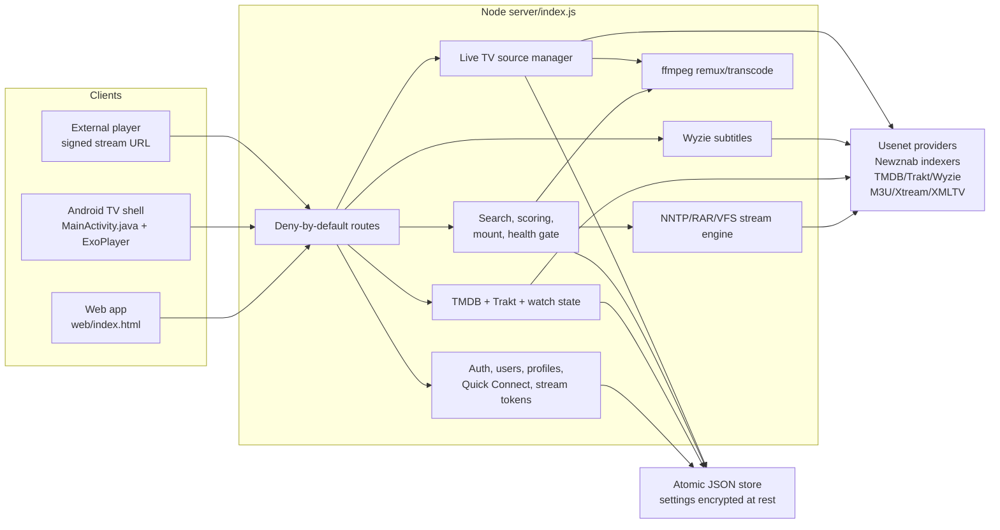
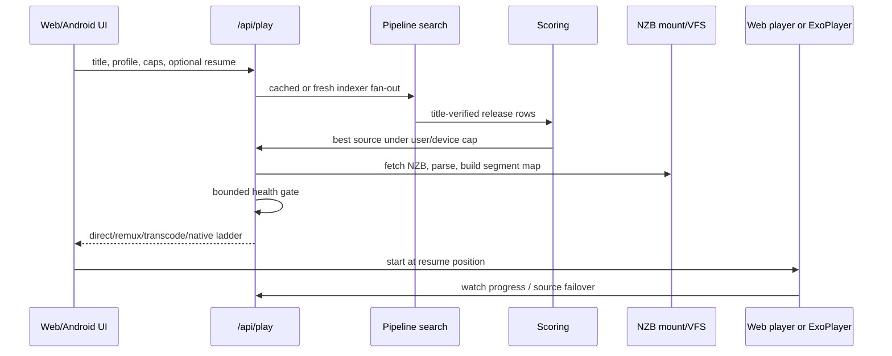
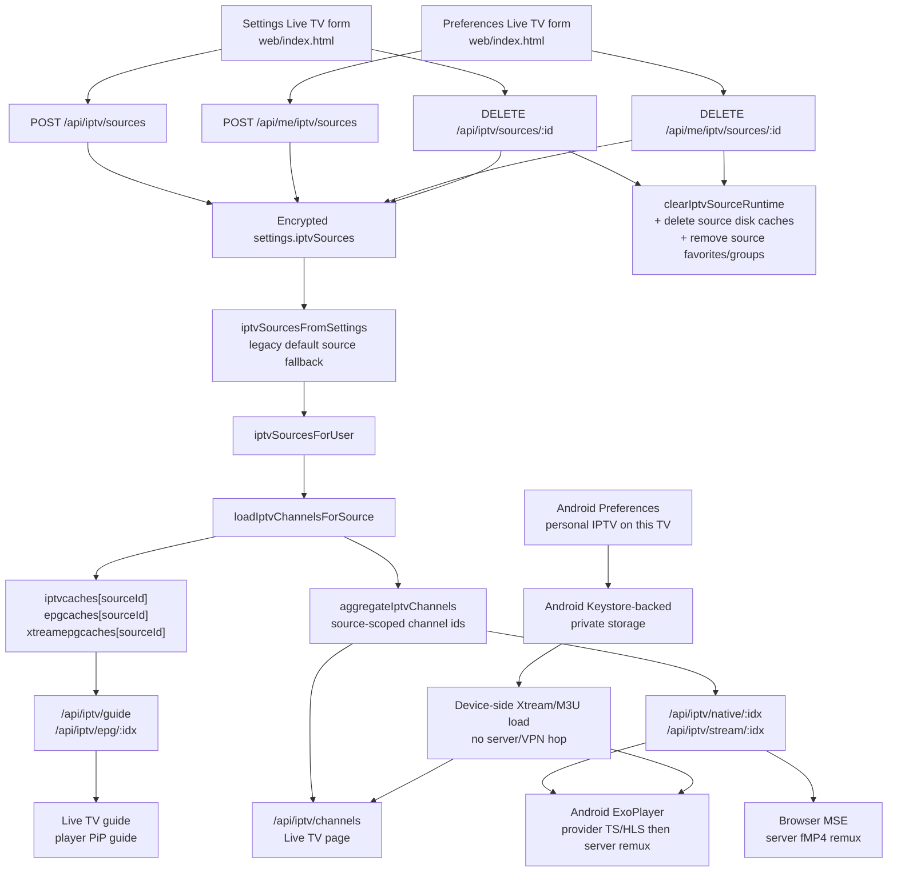

# Triboon Architecture And Runtime Map

Triboon is a self-hosted streaming app: one admin configures providers, indexers,
metadata, subtitles, Live TV, and users; everyone else joins with normal app
accounts and presses Play. Speed is the product value. The server should pick the
best playable source quickly, direct play whenever possible, and only remux or
transcode when the device cannot play the original stream.

This file is the current architecture reference. If code moves, routes change,
or a cache gets a new owner, update this file and `docs-player-regression-map.md`
in the same change. For usenet capacity, provider connections, read-ahead, and
multi-user startup/seek behavior, `docs-streaming-performance.md` is the
canonical reference.

## Current Snapshot

- Server: Node 24 LTS, stdlib runtime, no runtime npm dependencies in `server/`.
- UI: `web/index.html`, one web app with TV D-pad navigation and browser support.
- Android TV: Java WebView shell with native Media3/ExoPlayer for video and Live TV.
- Data: atomic JSON store in `TRIBOON_DATA` plus encrypted settings through
  `server/auth.js` `SecureSettings`.
- Playback order: source-fit, direct play, remux, transcode.
- Security: deny-by-default route table in `server/index.js`; every endpoint must
  declare `public`, `user`, `admin`, or `stream` auth and be covered by tests.
- Current verification baseline after the multi-user streaming performance
  pass: full `npm.cmd test` covers 164 tests; focused IPTV, security, and NNTP
  priority tests cover the current source model, route table, and capacity
  scheduling.

## System Map

## Core Ownership

| Area | Owner files | Notes |
| --- | --- | --- |
| Auth and encrypted settings | `server/auth.js`, `server/index.js` | Users, invites, Quick Connect, HMAC stream tokens, AES-256-GCM settings. |
| Persistence | `server/store.js` | Atomic JSON buckets under the data directory; no SQLite dependency. |
| Metadata | `server/tmdb.js`, `server/trakt.js`, `server/index.js` | TMDB proxy/cache, Trakt link/sync/outbox, profile watch state. |
| Search and source ranking | `server/newznab.js`, `server/scoring.js`, `server/pipeline.js` | Title-safe matching, quality caps at source selection, health-aware ranking. |
| Streaming engine | `server/nzb.js`, `server/nntp.js`, `server/vfs.js`, `server/rar.js`, `server/zip.js`, `server/archive.js`, `docs-streaming-performance.md` | Clean-room NZB mount, article reads, RAR/ZIP extent maps, Range streaming, provider capacity, priority lanes, adaptive read-ahead. |
| Playback decision | `server/transcode.js`, `server/index.js`, `web/index.html`, `android/.../MainActivity.java` | Source-fit, direct, remux, transcode; Android native caps feed server policy. |
| Subtitles | `server/opensubs.js`, `server/index.js`, `web/index.html`, `MainActivity.java` | Wyzie search/download, release/file hints, WebVTT, web/native display timelines. |
| Local libraries | `server/index.js`, `web/index.html` | Folder scan, bounded library pages, local playback, local artwork. |
| Live TV | `server/index.js`, `web/index.html`, `MainActivity.java` | Source-scoped shared M3U/Xtream/XMLTV, web remux path, Android native Exo path, and Android device-local personal IPTV. |
| Continue Watching | `docs-continue-watching.md`, `server/index.js`, `web/index.html` | Canonical movie/show identity, resume state, quality carry-forward, next-up, and D-pad focus after row actions. |
| Android shell | `android/app/src/main/java/app/triboon/tv/MainActivity.java` | WebView bridge, D-pad/back handling, native video/Live TV, PiP guide recovery. |

## Press Play Pipeline

Rules that must not drift:

- User quality caps are enforced before transcoding, at source selection.
- The Sources drawer and the Play button share the same title verification and
  ranking path; manual source selection must mount the chosen release.
- Android capability claims come from the native bridge, not WebView guesses.
- After ExoPlayer reaches READY, normal buffering must not remount or restart
  a movie from the beginning.
- Continue Watching follows `docs-continue-watching.md`: one canonical Home card
  per movie/show, active progress beats next-up, and the saved 4K/1080p source
  class carries into remaining TV episodes.

## Streaming Performance / Multi-User Capacity

Triboon treats performance as a capacity model, not a single "more connections"
knob. The owner configures provider connection limits, expected simultaneous
users, quality mix, server download/upload speed, and buffer targets in Settings
-> Streaming performance. The server then saves an adaptive profile that the
playback pipeline uses for read-ahead and health probes.

The detailed contract is `docs-streaming-performance.md`. Keep this section as
the architecture summary only; do not duplicate tuning formulas here.

Required behavior:

- Provider connection limits are per account and may be up to 150, because some
  plans advertise 100+ connections. The recommendation flow should still avoid
  using more connections than the server/network can use efficiently.
- Multiple usenet providers combine into one pool, but each provider keeps its
  own cap. Least-loaded healthy providers receive article work first.
- NNTP work is priority-laned: startup/seek work outranks playback, playback
  outranks health checks, and health checks outrank background read-ahead.
- Read-ahead is adaptive. 1080p and 4K targets are saved as seconds for the
  owner, but the engine enforces them as a bounded article window so starts and
  seeks stay fast for other users.
- Health checks keep the 500ms upfront gate. Background triage is lower priority
  and must never starve the segment the player is actively waiting on.
- The historical Easynews benchmark in `bench/RESULTS.md` is evidence for the
  original fast-start assumptions, not a fixed runtime rule. Do not reintroduce
  hardcoded "16 warm connections" or "8-12 read-ahead" behavior without updating
  the capacity reference and tests.

## Live TV / IPTV Source Model

Live TV providers are first-class sources/playlists. There is no longer one
global IPTV cache that every provider shares.

Source contract:

- `settings.iptvSources[]` stores source identity, type, display name, M3U URL or
  Xtream host/user/pass, optional XMLTV URL, enabled flag, and user visibility.
- User-owned playlists are also stored in `settings.iptvSources[]`, with
  `ownerUserId` and a one-user visibility list. Browser, Android TV, and other
  signed-in clients use the same account source through `/api/me/iptv/sources`.
- Legacy single-source settings (`iptvMode`, `iptvUrl`, `xtHost`, `xtUser`,
  `xtPass`, `epgUrl`, `iptvUsers`) still migrate through a compatibility
  `default` source only when no new source list exists.
- `iptvcaches`, `epgcaches`, and `xtreamepgcaches` are keyed by source id.
  The old singular `iptvcache`, `epgcache`, and `xtreamepgcache` exist only for
  default-source compatibility.
- Xtream disk channel caches never persist stream URLs with credentials; URLs
  are rebuilt from encrypted settings at read time.
- Aggregated channel ids are source-scoped so duplicate channel names or URLs in
  two playlists do not collide.
- Favorites and hidden groups are user data, but entries belonging to a deleted
  source must be removed during delete cleanup.
- Adding, deleting, and re-adding the same playlist must fetch a fresh source
  cache and must not revive deleted channels.

Playback contract:

- Browser Live TV uses the server fMP4 remux path and must close the previous
  fetch/reader/remux before opening the next channel.
- Account personal IPTV uses the same server playback, guide, source cache, and
  delete cleanup path as shared playlists. Stream URLs bind both the channel
  position and source-scoped channel id so a stale channel cache cannot drift to
  another user's source.
- Android TV tries native provider-compatible URLs first. Xtream prefers TS,
  with HLS as fallback, then the server remux path for devices that cannot
  handle the provider stream directly.
- Android TV can also hold personal IPTV sources in the native app. Those
  sources are loaded by `MainActivity.java` from the Android device network,
  merged into `web/index.html` Live TV rows, and played directly by ExoPlayer.
  They are encrypted with Android Keystore-backed app storage, intentionally not
  sent to the Triboon server, not included in server guide caches, and not
  shared with other users or devices.
- Provider errors are sanitized. Logs may include source id, channel name,
  status, and reason, but never credential-bearing provider URLs.
- A provider 401/403/429 against a cached Xtream stream id must force-refresh
  the source list and retry the same cleaned channel before surfacing failure.
- Background Live TV warmups must not steal responsiveness from active playback;
  visible guide/now-next requests still use bounded source-specific guide paths.

Related verification:

- `test/iptv-cache.test.js` covers source-scoped channels, delete cleanup,
  clean re-add, large M3U stream parsing, XMLTV persistence, retune cleanup, and
  provider failure handling.
- `test/security.test.js` covers route auth and IPTV credential redaction.
- Android stress QA should include 20 Live TV zaps, PiP guide open/back loops,
  and no fatal/provider-protection log markers.

## Data Model

The current implementation uses JSON buckets through `server/store.js`.

| Store bucket | Owner | Purpose |
| --- | --- | --- |
| `secret` | `server/auth.js` | Generated app secret when `TRIBOON_SECRET` is not supplied. |
| `settings` | `SecureSettings` | Encrypted admin settings: providers, indexers, TMDB, subtitles, Trakt app, Live TV sources, streaming performance profile. |
| `users`, `invites` | `server/auth.js`, `server/index.js` | Accounts, roles, profile policy, invites. |
| `watch`, `watchlist` | `server/index.js`, `server/trakt.js` | Per-profile progress, watched state, watchlist, Trakt-imported fallback rows. |
| `trakt`, `traktOutbox` | `server/trakt.js` | User tokens, sync state, queued scrobble/export operations. |
| `libraries`, `libitems` | `server/index.js` | Attached local folders and scanned item snapshots. |
| `verdicts`, `ixusage`, `tmdb-cache` | `server/store.js`, `server/index.js`, `server/tmdb.js` | Health verdicts, per-indexer daily usage, metadata cache. |
| `iptvcaches`, `epgcaches`, `xtreamepgcaches` | `server/index.js` | Source-scoped channel, XMLTV, and Xtream guide caches. |
| `iptvfavs`, `iptvgroups` | `server/index.js` | Per-user Live TV favorites and hidden groups. |
| Android `personalIptvSources` | `MainActivity.java` | Device-local IPTV sources saved through Android Keystore-backed private preferences, redacted before the web UI reads them. |

When changing persistence, update:

- the store bucket owner here,
- route auth coverage,
- migration/compatibility behavior for existing data,
- focused tests that prove old data still loads safely.

## Client Responsibilities

### Web UI

- Owns navigation, D-pad focus, browser player chrome, Live TV guide UI, Settings,
  and player overlay behavior.
- Must show a usable shell in under 1 second on Android TV-class devices.
- Must lazy-load large local libraries and catalogs after first focus.
- Must keep Live TV categories in their own lane: Up/Down stays in categories,
  Right enters channels.

### Android TV

- Owns native Media3/ExoPlayer playback for VOD and Live TV.
- Sends native capability claims to the web UI/server before source selection.
- Routes Back through the web `__tvBack()` contract unless native sheets/player
  chrome need to close first.
- Recovers WebView renderer crashes by restoring the last app route or promoting
  native playback out of PiP.

## Security Rules

- Every new endpoint must be added to `ROUTES` with the correct auth level.
- Stream routes require signed stream tokens bound to one mount, file, channel,
  or local item.
- Credentials live in encrypted settings and must not appear in caches, logs,
  UI strings, screenshots, or Git history.
- Remote strings from indexers, providers, metadata, Live TV playlists, and
  subtitles must be escaped before UI insertion.
- Size caps stay on fetched playlists, guides, NZBs, subtitle files, and any
  other untrusted provider response.

## Current Roadmap

Done and verified in the current architecture:

- Phase 1: NZB/RAR/ZIP streaming engine with seeking and multi-provider failover.
- Phase 2: Newznab fan-out, scoring, verdict cache, press-play pipeline.
- Phase 3: auth, invites, Quick Connect, encrypted settings, TMDB proxy, watch state.
- Phase 4: profiles, source caps, remux/transcode ladder, web player, D-pad UI.
- Phase 5 core: Android TV shell, native Media3/ExoPlayer handoff, native Live TV,
  subtitles, Trakt sync, local-library performance work, screensaver, PiP guide,
  source-scoped IPTV playlists, and owner-tunable multi-user streaming capacity.

Still open / future hardening:

- Broader Android hardware matrix automation for Shield, Onn, Fire TV, Chromecast,
  Google TV, and low-memory devices.
- Tauri desktop.
- par2 repair and compressed RAR streaming improvements.
- MDBList and richer catalog rows.
- Intro/credit skip after the playback foundation stays stable.
- Release automation polish: version bump, APK build, GitHub release, stable
  Android TV/mobile APK aliases, and Unraid update confirmation for every
  public release.

## Verification Checklist For Architecture Changes

Run the narrow test for the area touched, then the broader suite before a release:

- Engine or source selection: `npm.cmd test` on Windows, or `npm test` where
  shell policy allows it.
- Streaming capacity/read-ahead/provider changes: `node --test test/e2e.test.js`,
  `node --test test/security.test.js`, `node --test test/phase2.test.js`, then
  `npm.cmd test`.
- IPTV source/cache/playback: `node --test test/iptv-cache.test.js` and
  `node --test test/security.test.js`.
- Web UI behavior: start `node server/index.js`, open `http://localhost:7777`,
  and visually check the route.
- Android TV behavior: build the APK, run the emulator/Shield smoke or
  `bench/android-tv-stress.ps1`, and inspect logs for fatal/provider errors.
- Android release packaging: attach `triboon-tv-vX.Y.Z.apk`, `triboon-tv.apk`,
  `android-tv-vX.Y.Z.apk`, `android-tv.apk`, `android-mobile-vX.Y.Z.apk`, and
  `android-mobile.apk` to the GitHub release. Stable Downloader URLs are
  `https://github.com/d1same/triboon/releases/latest/download/triboon-tv.apk`
  and
  `https://github.com/d1same/triboon/releases/latest/download/android-tv.apk`
  and
  `https://github.com/d1same/triboon/releases/latest/download/android-mobile.apk`;
  Android update acceptance still depends on package id, signing key, and a
  higher versionCode.
- Documentation: scan for stale phase counts, old stack names, old cache
  ownership statements, and old fixed-connection/read-ahead tuning before
  calling the work done.

## Non-Goals

- No Sonarr/Radarr dependency for normal operation.
- No cloud relay or central service.
- No runtime server npm dependencies without owner approval.
- No credential-bearing provider URLs in public docs, logs, UI, tests, or commits.

For legally obtained content only.
