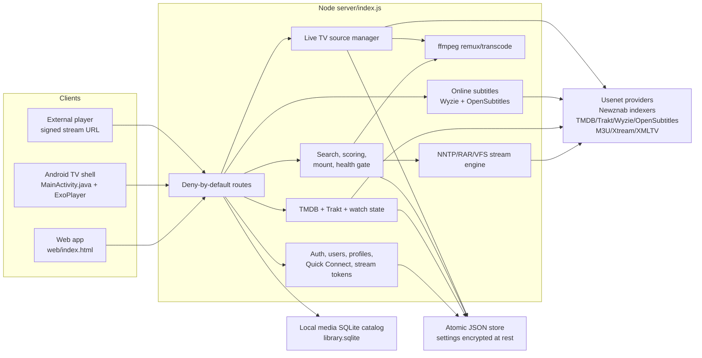
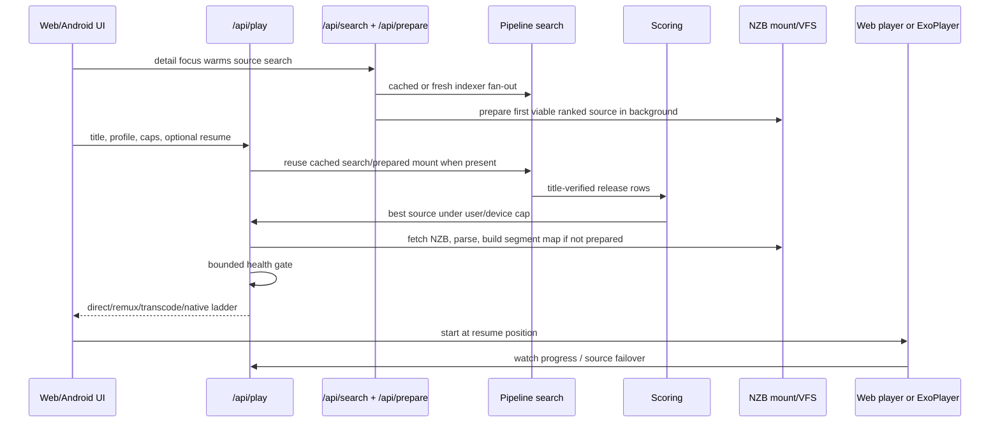
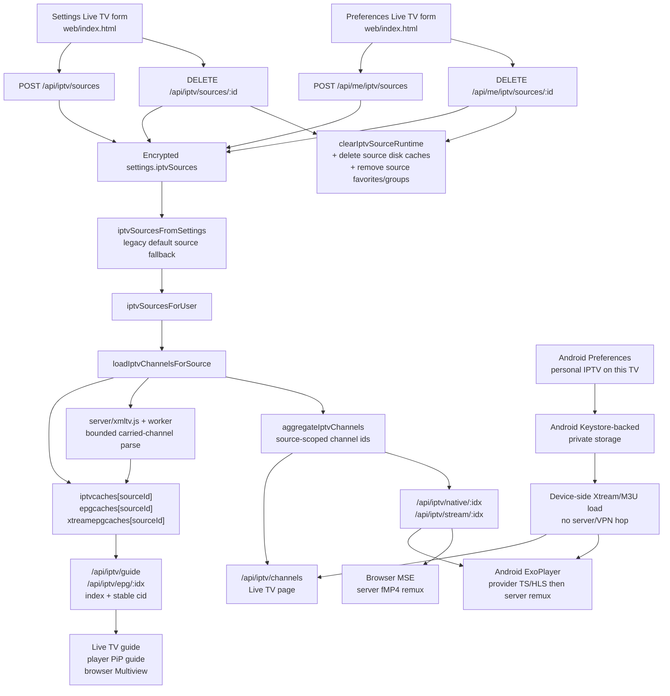

# Triboon Architecture And Runtime Map

Triboon is a self-hosted streaming app: one admin configures providers, indexers,
metadata, subtitles, Live TV, and users; everyone else joins with normal app
accounts and presses Play. Speed is the product value. The server should pick the
best playable source quickly, direct play whenever possible, and only remux or
transcode when the device cannot play the original stream.

This file is the current architecture reference. If code moves, routes change,
or a cache gets a new owner, update this file and `docs-player-regression-map.md`
in the same change. For usenet capacity, provider connections, read-ahead, and
multi-user startup/seek behavior, `docs-streaming-performance.md` is the
canonical reference.

## Current Snapshot

- Server: Node 24 LTS, stdlib runtime, no runtime npm dependencies in `server/`.
- UI: `web/index.html`, one web app with TV D-pad navigation and browser support.
- Android TV: Java WebView shell with native Media3/ExoPlayer for video and Live TV.
- Data: atomic JSON store in `TRIBOON_DATA`, AES-256-GCM encrypted settings
  through `server/auth.js` `SecureSettings`, and a local-media-only SQLite
  catalog (`library.sqlite`) for large attached folders. Users, password
  hashes, watch state, library metadata, and caches are persistent but are not
  application-encrypted; filesystem and backup protection remain the owner's
  responsibility.
- Playback order: source-fit, direct play, remux, transcode.
- Security: deny-by-default route table in `server/index.js`; every endpoint must
  declare `public`, `user`, `admin`, or `stream` auth and be covered by tests.
- Delivery: the public GHCR image contains the application only, targets
  `linux/amd64` and `linux/arm64`, and receives credentials/state only at
  runtime through persistent `/data`, the dashboard, or explicit environment
  variables.
- `npm.cmd test` explicitly enumerates every top-level `test/*.test.js` suite
  and runs them sequentially because integration suites share process-wide
  state. The release-contract test requires that list to match the checked-in
  suites exactly and excludes fixture generators. Exact pass counts belong in
  dated `VERIFY.md` evidence, not this long-lived architecture reference.

## System Map

## Core Ownership

| Area | Owner files | Notes |
| --- | --- | --- |
| Auth and encrypted settings | `server/auth.js`, `server/index.js` | Users, invites, Quick Connect, admin TOTP 2FA, HKDF-separated HMAC session/stream tokens, session epochs, AES-256-GCM settings. |
| Persistence | `server/store.js`, `server/library-db.js` | JSON remains the app state store. `library.sqlite` indexes scanned local-media items only, so 80k+ attached files can page and look up without loading every item into the UI. |
| Metadata | `server/tmdb.js`, `server/trakt.js`, `server/index.js` | TMDB proxy/cache, encrypted Trakt link tokens, Trakt sync/outbox, profile watch state. |
| Search and source ranking | `server/newznab.js`, `server/scoring.js`, `server/pipeline.js` | Title-safe matching, quality caps at source selection, health-aware ranking, bounded cold-source hedging, and episode/audiobook-scoped mount reuse. |
| Streaming engine | `server/nzb.js`, `server/nntp.js`, `server/vfs.js`, `server/rar.js`, `server/zip.js`, `server/archive.js`, `docs-streaming-performance.md` | Clean-room NZB mount, requested-episode selection inside season-pack archives, article reads, RAR/ZIP extent maps, Range streaming, provider capacity, priority lanes, adaptive read-ahead. |
| Playback decision | `server/transcode.js`, `server/index.js`, `web/index.html`, `android/.../MainActivity.java` | Source-fit, direct, remux, transcode; Android native caps feed server policy. |
| Subtitles | `server/opensubs.js`, `server/index.js`, `web/index.html`, `MainActivity.java` | Wyzie catalog/release search plus optional OpenSubtitles hash-exact/catalog search, combined ranking, download fallback, WebVTT caches, and web/native display timelines; built-in extraction is opt-in. |
| Local libraries | `server/index.js`, `server/library-db.js`, `web/index.html` | Folder scan, SQLite-backed bounded pages/lookups, local playback, local artwork. |
| Live TV | `server/index.js`, `server/xmltv.js`, `server/xmltv-worker.js`, `web/index.html`, `MainActivity.java` | Source-scoped shared M3U/Xtream/XMLTV, bounded worker-thread guide parsing, web remux path, Android native Exo path, and Android device-local personal IPTV. |
| Music Home | `server/ytmusic.js`, `server/index.js`, `web/index.html` | YouTube Music search/home/charts via optional `ytmusicapi`; public search/radio without an account; encrypted per-user imported browser-cookie sessions for personal playlists; bounded `yt-dlp` playback resolver, tokenized audio proxy, web mini-player, and no ExoPlayer handoff for audio yet. |
| Continue Watching | `docs-continue-watching.md`, `server/index.js`, `web/index.html` | Canonical movie/show identity, resume state, quality carry-forward, next-up, and D-pad focus after row actions. |
| Android shell | `android/app/src/main/java/app/triboon/tv/MainActivity.java` | WebView bridge, D-pad/back handling, native video/Live TV, PiP guide recovery, APK update links. |

## Press Play Pipeline

Rules that must not drift:

- User quality caps are enforced before transcoding, at source selection.
- The Sources drawer and the Play button share the same title verification and
  ranking path; manual source selection must mount the chosen release.
- Detail-page source warmup is a startup-speed feature. Title-only warmup
  results can feed the later exact-id Play request. When the Play target is
  stable, `/api/prepare` may mount the first viable source from a small capped
  slice of the ranked list in the background without creating a play session or
  stream URL. Play must reuse or join that prepared/in-flight mount and
  in-flight NZB prefetch instead of repeating source finding, first-article
  probe, mount, or health-gate work.
- Prepared, in-flight, and live-mount reuse is keyed by NZB URL plus season,
  episode, and audiobook mode. Loose-file and RAR/ZIP season packs must select
  exactly one requested `SxxEyy` payload before file size is considered, and
  the first-article probe must target that same payload. Missing or ambiguous
  members and post-mount member failures advance this request without poisoning
  release-wide health; a combined range counts only when it covers the request.
  That request-scoped verdict rule applies only to collection-shaped names such
  as season packs and multi-episode ranges: a selected loose-pack article or
  post-mount member failure cannot blacklist sibling episodes. An archive
  first-volume failure stays release-wide because every member depends on that
  volume set, and exact single-episode releases keep missing/blocked verdicts
  cached release-wide so later source walks skip a known-bad release quickly.
  Thus an E05 request can neither mount nor blacklist an unrelated E01 payload.
- Cold Play starts with the top-ranked candidate. If it is still pending after
  800ms, one lower-ranked understudy may start. Once a lower-ranked healthy
  source is ready, pending higher ranks receive only 250ms of final grace and
  no more candidates launch; losing startup consumers are cancelled before the
  winner is registered and warmed. Shared startup work remains alive while any
  other play still consumes it, but a playable first frame must not wait behind
  or leave capacity occupied by a stuck candidate's full mount deadline. A
  terminal missing probe or mount deadline also aborts its underlying startup
  BODY before returning.
- Android capability claims come from the native bridge, not WebView guesses.
  Video caps are decoder-based, but HD-audio passthrough caps must come from
  the active HDMI/ARC/eARC audio output encodings. TrueHD/Atmos/DTS-HD releases
  are preferred and direct-played only when the current native device reports
  matching passthrough support; budget devices and browsers keep the safer
  WEB-sized/remux-to-AAC path. Low-power Android TV and older Chromecast-class
  devices also prefer AVC/H.264 for 1080p auto-picks when an AVC source is
  available, while HEVC/AV1 remain available as fallback/manual sources.
- After ExoPlayer reaches READY, normal buffering must not remount or restart
  a movie from the beginning.
- Continue Watching follows `docs-continue-watching.md`: one canonical Home card
  per movie/show, active progress beats next-up, and the saved 4K/1080p source
  class carries into remaining TV episodes.

## Now Watching / Activity

Clients send a lightweight `/api/presence` heartbeat every 25 seconds while the
app is open, whether browsing or watching. These device rows are in-memory with
a 70-second TTL. Players also send `/api/activity` while playback is active;
those Now Watching rows are in-memory with a 45-second TTL. Regular users may
write only their own rows, while only admins may read Settings -> Activity.

The activity store retains at most 60 movie/TV rows from the last three days so
the owner can see recent VOD playback without accumulating a long-term log.
Live TV/IPTV is current-activity only. Neither location labels nor raw viewer IPs
are written to retained history.

The heartbeat carries both the client path and the stream treatment:

- `player`: `web` or `exo`, showing which player surface owns playback.
- `mode`: the player transport label, such as Direct, Remux, Transcode, or
  ExoPlayer.
- `streamKind` / `streamLabel`: the owner-facing quality status. Movies and
  episodes show `Original`, `Original (remux)`, or `Transcoding`; Live TV shows
  `Live`.
- `clientVersion`: the web or Android app version when the client can report it,
  so the owner can spot TVs/phones that need an update.

This distinction matters because remux is still original-quality playback, while
transcoding means Triboon is actively converting the stream for device support
or a requested quality cap.

## Subtitle Model

Online subtitles are the default production path. The admin chooses
`wyzie-first` (the default), `opensubtitles-first`, `wyzie-only`, or
`opensubtitles-only`. Wyzie uses the dashboard key, or `TRIBOON_WYZIE_KEY` when
the dashboard key is empty, and searches by TMDB/IMDb id plus the selected
release/file hints. The optional direct OpenSubtitles provider is active only
when its API key, display username, and password are all configured; the API
key alone can search upstream, but Triboon needs the login to download a result.

Allowed online providers search in parallel. For a mounted file,
OpenSubtitles first computes its first/last-64-KiB movie hash plus file size for
exact-file matching, then falls back to catalog-id matching. Triboon combines
and ranks the provider rows, downloads the selected SRT/VTT, caches captions per
mount/language, and keeps a persistent OpenSubtitles VTT cache under `/data` so
replays do not burn daily download quota. OpenSubtitles login/JWT/download
failures fall back to the ranked Wyzie ladder when the selected source policy
and configured Wyzie key allow it. Captions are served through signed
stream-scope URLs.

Built-in subtitles are an admin-controlled opt-in because embedded text
extraction may require ffmpeg to scan much of the media file. When built-ins
are off, the web and Android players hide embedded/sidecar rows, skip built-in
prewarm/extraction, and go directly to online captions when the catalog id and
at least one allowed online provider are available. When built-ins are on,
release sidecars and embedded text tracks can be tried before online fallback,
but bitmap-only subtitle tracks are not useful as WebVTT captions.

Android native playback displays server-provided VTT through Triboon's native
overlay so subtitle version changes and sync changes do not rebuild ExoPlayer.
The web overlay respects left, right, and bottom safe areas and caps its height
above the player controls. The native overlay applies the S/M/L caption-size
preference, converts line-break tags and safe entities, removes remaining
markup, and displays at most the last three overlapping cue texts. The current
native path is intentionally online-first for stability; deeper embedded-track
handoff would need a separate Media3 subtitle contract and device matrix.

When built-in subtitles are off, web playback also skips the optional 1.4-second
track-probe wait before warming online subtitles. Optional embedded extraction
must not delay the default online-caption path.

## Streaming Performance / Multi-User Capacity

Triboon treats performance as a capacity model, not a single "more connections"
knob. The owner configures provider connection limits, expected simultaneous
users, quality mix, server download/upload speed, and buffer targets in Settings
-> Streaming performance. The server then saves an adaptive profile that the
playback pipeline uses for read-ahead and health probes.

The detailed contract is `docs-streaming-performance.md`. Keep this section as
the architecture summary only; do not duplicate tuning formulas here.

Required behavior:

- Provider connection limits are per account and may be up to 150, because some
  plans advertise 100+ connections. The recommendation flow should still avoid
  using more connections than the server/network can use efficiently.
- Multiple usenet providers combine into one pool, but each provider keeps its
  own cap. Least-loaded healthy providers receive article work first.
- NNTP work is priority-laned: startup/seek work outranks playback, playback
  outranks health checks, and health checks outrank background read-ahead.
- Read-ahead is adaptive. 1080p and 4K targets are saved as seconds for the
  owner, but the engine enforces them as a bounded article window so starts and
  seeks stay fast for other users.
- Health checks keep the 500ms upfront gate. Background triage is lower priority
  and must never starve the segment the player is actively waiting on.
- After web VOD has genuinely started, a waiting state with no meaningful
  position progress for 45 seconds retries the same source, playback kind, and
  timestamp first. Recovery must not silently advance to a different release.
- Historical local-only Easynews benchmark evidence supports the original
  fast-start assumptions, but it is not part of a clean clone and is not a fixed
  runtime rule. Do not reintroduce hardcoded "16 warm connections" or "8-12
  read-ahead" behavior without updating the capacity reference and tests.

## Live TV / IPTV Source Model

Live TV providers are first-class sources/playlists. There is no longer one
global IPTV cache that every provider shares.

Source contract:

- `settings.iptvSources[]` stores source identity, type, display name, M3U URL or
  Xtream host/user/pass, optional XMLTV URL, enabled flag, and user visibility.
- User-owned playlists are also stored in `settings.iptvSources[]`, with
  `ownerUserId` and a one-user visibility list. Browser, Android TV, and other
  signed-in clients use the same account source through `/api/me/iptv/sources`.
- Legacy single-source settings (`iptvMode`, `iptvUrl`, `xtHost`, `xtUser`,
  `xtPass`, `epgUrl`, `iptvUsers`) still migrate through a compatibility
  `default` source only when no new source list exists.
- `iptvcaches`, `epgcaches`, and `xtreamepgcaches` are keyed by source id.
  The old singular `iptvcache`, `epgcache`, and `xtreamepgcache` exist only for
  default-source compatibility.
- Xtream disk channel caches never persist stream URLs with credentials; URLs
  are rebuilt from encrypted settings at read time.
- Aggregated channel ids are source-scoped so duplicate channel names or URLs in
  two playlists do not collide.
- Favorites and hidden groups are user data, but entries belonging to a deleted
  source must be removed during delete cleanup.
- Adding, deleting, and re-adding the same playlist must fetch a fresh source
  cache and must not revive deleted channels.
- XMLTV downloads are single-flight per source/key and capped before parsing,
  so a cold multi-channel guide request cannot multiply a large download or
  worker. Headerless `.xml.gz` payloads are detected by their gzip signature and
  the expanded body is capped too. The decoded guide buffer is transferred to a
  globally two-wide worker queue, filtered to channels the playlist actually
  carries, and terminated cleanly on timeout or shutdown. Non-2xx responses are
  failures, never empty-success caches. Source edit/delete invalidates the old
  generation, and shutdown aborts and drains downloads/workers before the store
  closes, so late work cannot resurrect a cache. A valid stale cache may be
  served while refresh runs so guide parsing never blocks video, zaps, health
  checks, or the HTTP event loop.

Playback contract:

- Browser Live TV uses the server fMP4 remux path and must close the previous
  fetch/reader/remux before opening the next channel.
- Channel hydration is last-intent-wins. Main, split, and Multiview surfaces own
  independent monotonic tune epochs; a slow response from an older selection
  must not retune after a newer zap or revive a closed pane.
- Browser Live TV owns the live-only player chrome. It hides VOD subtitle,
  audio, surround, and quality controls, shows favorite, and keeps movie/show
  playback controls unchanged.
- Browser Multiview is a separate Live TV surface launched from guide contexts.
  It uses isolated MediaSource state per pane against the same server fMP4
  remux path, supports two, three, or four panes, and routes audio only through
  the highlighted pane. Two panes are side-by-side, three panes use a featured
  primary pane plus two smaller panes, and four panes use a 2x2 grid. Guide
  launchers and close controls stay icon-led so the surface matches the rest of
  the player chrome and remains D-pad scannable. Android TV exposes the same
  Live TV and PiP guide launchers, but only this explicit Multiview surface may
  use the WebView/server fMP4 path, and only after a MediaSource support check.
- Pane hover/focus changes the audible pane. OK on a filled pane opens a compact
  pane action row; Live TV panes expose fullscreen/return, swap screen, change
  channel/title, and close screen, while movie/show companion panes also expose
  Back 10s, Play/Pause, and Forward 30s. Empty panes still open the picker
  directly. Browser fullscreen is an internal zoomed-pane state inside
  Multiview so Back/Escape returns to the grid without remounting streams. Swap
  changes visual order only, letting a 3-up secondary pane become the featured
  pane while its MediaSource/video element stays mounted.
- Multiview is capped at four panes because each active pane can consume a
  provider stream and server remux work. Pane failures stay local to that pane
  instead of closing the whole player. Provider `429`/rate-limit responses are
  surfaced as likely IPTV account stream limits so users know why only one
  active channel may work on a single-line provider plan.
- The picker includes Continue Watching as a companion source. Browser
  Multiview can carry an active movie/episode into the first pane or start one
  Continue Watching movie/show through the normal `/api/play` source-selection
  path. VOD companion playback is limited to one pane until explicit capacity
  accounting exists for multiple NZB mounts, health gates, read-ahead windows,
  remuxes, and transcodes. VOD pane seeking follows the main player policy:
  direct playback seeks the element, while remux/transcode panes restart that
  pane at the requested timestamp.
- Account personal IPTV uses the same server playback, guide, source cache, and
  delete cleanup path as shared playlists. Stream URLs bind both the channel
  position and source-scoped channel id so a stale channel cache cannot drift to
  another user's source.
- Server/account channels and Android device-local channels start loading in
  parallel and merge deterministically server-first. Concurrent callers join
  one Android bridge load; a foreground caller may extend that same request's
  timeout instead of creating a duplicate callback slot.
- Now/next and timeline requests bind each mutable channel index to its stable
  source-scoped `cid`, including their browser memo keys. The server resolves a
  drifted index by stable id when possible and returns 409 only when that
  channel identity no longer exists, which tells the client to reload the
  lineup.
- Android TV/mobile tries native provider-compatible HLS/MPEG-TS URLs first.
  Xtream prefers TS, with HLS as fallback, then the server stereo-AAC fMP4 remux
  path for devices or providers that cannot hold the native stream directly.
- Android TV/mobile normal single-channel playback must not use browser Live TV
  over the WebView. The explicit Multiview feature is the exception: it is
  launched from D-pad reachable Live TV/PiP guide buttons and uses the
  browser/server fMP4 surface only when the Android WebView supports
  MediaSource. A future native Multiview can replace this with a dedicated
  Media3/ExoPlayer multi-surface design plus memory, decoder, and
  provider-connection testing.
- Android TV can also hold personal IPTV sources in the native app. Those
  sources are loaded by `MainActivity.java` from the Android device network,
  merged into `web/index.html` Live TV rows, and played directly by ExoPlayer.
  They are encrypted with Android Keystore-backed app storage, intentionally not
  sent to the Triboon server, not included in server guide caches, and not
  shared with other users or devices.
- Every server IPTV URL open runs through the SSRF guard. Node HTTP fetches use
  a pinned DNS lookup, and the browser fMP4 remux path gives ffmpeg a pinned IP
  URL plus the original `Host` header with upstream redirects disabled.
- Android device-local IPTV validates every resolved address, including
  IPv4-mapped IPv6 and NAT64 forms. ExoPlayer and subtitle/manual HTTP fetches
  connect to the pinned address and send the original `Host` header. Hostname
  HTTPS device-local IPTV is not allowed in this Android shell because it cannot
  be DNS-pinned without replacing the TLS socket stack; add those providers as
  account/server IPTV instead.
- Provider errors are sanitized. Logs may include source id, channel name,
  status, and reason, but never credential-bearing provider URLs.
- A provider 401/403/429 against a cached Xtream stream id must force-refresh
  the source list and retry the same cleaned channel before surfacing failure.
- Background Live TV warmups must not steal responsiveness from active playback;
  visible guide/now-next requests still use bounded source-specific guide paths.

Related verification:

- `test/iptv-cache.test.js` covers source-scoped channels, delete cleanup,
  clean re-add, large M3U stream parsing, XMLTV persistence, retune cleanup, and
  provider failure handling.
- `test/xmltv.test.js` covers entity decoding, carried-channel filtering, and
  worker parsing without monopolizing the main event loop.
- `test/phase4.test.js` covers tune epochs, single-flight device loads,
  concurrent server/device merging, and stable guide ids.
- `test/security.test.js` covers route auth and IPTV credential redaction.
- Android stress QA should include 20 Live TV zaps, PiP guide open/back loops,
  and no fatal/provider-protection log markers.

## Data Model

The app state store remains JSON buckets through `server/store.js`. Large
attached local-library scans are the one exception: scanned media items live in
`TRIBOON_DATA/library.sqlite` via `server/library-db.js`, while the library
definitions stay in JSON.

| Store bucket | Owner | Purpose |
| --- | --- | --- |
| `secret` | `server/auth.js` | Generated app secret when `TRIBOON_SECRET` is not supplied. |
| `settings` | `SecureSettings` | Encrypted admin settings: providers, indexers, TMDB, subtitles, Trakt app and linked Trakt OAuth tokens, Live TV sources, streaming performance profile. |
| `users`, `invites` | `server/auth.js`, `server/index.js` | Accounts, roles, profile policy, session epoch, invites, encrypted admin TOTP secret, hashed recovery codes. |
| `watch`, `watchlist` | `server/index.js`, `server/trakt.js` | Per-profile progress, watched state, watchlist, Trakt-imported fallback rows. |
| `activityHistory` | `server/index.js` | Admin-only, at most 60 movie/TV playback rows from the last three days; Live TV/IPTV rows and location are not retained. |
| `trakt`, `traktOutbox` | `server/trakt.js` | Legacy migration/sync marker bucket and queued scrobble/export operations. OAuth tokens must live encrypted inside `settings.traktTokens`, not plaintext `trakt.json`. |
| `libraries` | `server/index.js` | Attached local folders, owner visibility, kind, path, and display metadata. |
| `library.sqlite` | `server/library-db.js` | Scanned local media catalog: item payloads, TMDB ids, episode keys, genres, sort/page indexes, and local lookup support. |
| `libitems` | `server/index.js` | Legacy scanned-item compatibility bucket. New successful scans delete the JSON copy when SQLite is available. |
| `verdicts`, `ixusage`, `tmdb-cache` | `server/store.js`, `server/index.js`, `server/tmdb.js` | Health verdicts, per-indexer daily usage, metadata cache. |
| `iptvcaches`, `epgcaches`, `xtreamepgcaches` | `server/index.js` | Source-scoped channel, XMLTV, and Xtream guide caches. |
| `iptvfavs`, `iptvgroups` | `server/index.js` | Per-user Live TV favorites and hidden groups. |
| Android `personalIptvSources` | `MainActivity.java` | Device-local IPTV sources saved through Android Keystore-backed private preferences, redacted before the web UI reads them. |

When changing persistence, update:

- the store bucket owner here,
- route auth coverage,
- migration/compatibility behavior for existing data,
- focused tests that prove old data still loads safely.

## Client Responsibilities

### Web UI

- Owns navigation, D-pad focus, browser player chrome, Live TV guide UI, Settings,
  and player overlay behavior.
- Must show a usable shell in under 1 second on Android TV-class devices.
- Must lazy-load large local libraries and catalogs after first focus.
- Uses `/api/libraries/local-lookup` to resolve playable local copies on demand
  instead of loading every attached-library item on startup.
- Sends `/api/presence` while the app is open and `/api/activity` while a user
  is watching. Online devices and Now Watching are in-memory presence views;
  up to 60 recent VOD rows persist for three days. Live TV and location do not.
- The player stats panel is a basic support/debug view: player path, quality,
  source/file label, size, position, buffer, video/audio format, dropped frames
  where available, and bandwidth estimate where available.
- Must keep Live TV categories in their own lane: Up/Down stays in categories,
  Right enters channels.

### Android TV

- Owns native Media3/ExoPlayer playback for VOD and Live TV. The fullscreen
  path uses a `SurfaceView` player surface, decoder fallback, closest-sync
  seeks, seeded bandwidth, byte-bounded VOD buffers, short back buffers, live
  target-offset tuning, conservative-device HLS caps, and audio offload where
  Android supports it. Sustained post-start VOD stalls trim UI caches and retry
  the same source at the last trustworthy timestamp instead of silently
  switching release or quality.
- Sends native capability claims to the web UI/server before source selection,
  including HDMI/ARC/eARC audio-output passthrough flags for AC3, E-AC3, E-AC3
  JOC, DTS, DTS-HD, and TrueHD. Conservative/budget device detection is allowed
  to suppress HD-audio passthrough even when a codec appears in MediaCodec, and
  low-power devices prefer 1080p AVC/H.264 over HEVC/AV1 for automatic playback
  to keep startup, seeking, and recovery stable on older Chromecast-class boxes.
- Sends native playback stats back to the web UI during ExoPlayer playback and
  exposes the stable GitHub APK aliases through a guarded update-link bridge.
- Shows a native setup/compatibility screen before loading the WebView, refuses
  very old WebView providers, hardware-layers the WebView, defers APK-update
  cache clearing until after first paint, and trims caches on Android low-memory
  callbacks.
- Routes Back through the web `__tvBack()` contract unless native sheets/player
  chrome need to close first.
- Recovers WebView renderer crashes by restoring the last app route or promoting
  native playback out of PiP.
- Applies the web S/M/L subtitle preference to the native overlay, cleans VTT
  markup/entities, and bounds overlapping cue text to the last three entries.
- Excludes server addresses, login state, and device-local IPTV credentials from
  Android cloud backup and device-to-device transfer; users reconnect after a
  restore.

### Windows desktop

- Uses Tauri v2/WebView2 for the shared Triboon UI and a dedicated native
  libmpv window for VOD and Live TV. The web state machine remains authoritative
  for source selection, playback identity, watch state, Trakt, next episode,
  subtitles, and guide state; Rust owns the native window, mpv lifetime, input,
  and event observation.
- Keeps one mpv owner alive across source, quality, seek-remount, and episode
  replacement. The player window and last frame/loading surface stay topmost
  during asynchronous replacements so show details never flash between
  episodes.
- Uses D3D11 rendering and safe automatic hardware decoding with software
  fallback. Runtime `hwdec-current`, not configuration or CI success, is the
  proof of GPU decoding. HDR and audio passthrough remain capability-dependent;
  passthrough is opt-in.
- Mirrors the tokened `TriboonTV` callback contract used by Android. Native
  progress is the single clock feeding Continue Watching, Trakt, near-end
  preparation, Up Next, and recovery. Stale events from a replaced token cannot
  mutate the current player.
- Loads the remote web UI only for the validated configured server origin. The
  remote page receives a narrow injected playback bridge, never the general
  Tauri API. Native commands validate caller/origin, schema bounds, and
  same-server media/subtitle URLs; support output redacts URL query strings.
- Packages the dynamically linked LGPL `libmpv-2.dll`, third-party notices, the
  verbatim LGPL license, and exact source/rebuild/replacement instructions.
  Windows client and Windows server installers are separate release assets.

## Security Rules

- `POST /api/setup` is public only while no user exists because the first caller
  creates the owner. A fresh server must be initialized immediately from a
  trusted LAN; never publish port 7777 before that owner exists. Triboon serves
  HTTP directly for LAN compatibility. Remote access belongs behind a VPN or an
  HTTPS reverse proxy, and `TRIBOON_TRUST_PROXY=1` is safe only when that proxy
  strips client-supplied forwarding headers.
- Every new endpoint must be added to `ROUTES` with the correct auth level.
- Stream routes require signed stream tokens bound to one mount, file, channel,
  or local item.
- New session/stream tokens use HKDF-separated HMAC keys. Legacy raw-secret
  session tokens are accepted only during normal expiry; stream URLs must use
  the HKDF-scoped key. Password changes bump the user's session epoch so
  already-issued sessions and stream links stop working.
- Admin two-factor sign-in is optional and additive. When enabled, password
  login returns only a short-lived TOTP challenge until a valid authenticator
  code or single-use recovery code is provided. The TOTP secret is encrypted
  with a key derived separately from the server secret, recovery codes are
  stored only as scrypt hashes, and enabling/disabling 2FA bumps the session
  epoch to revoke older sessions.
- Session-token access to mount helpers is limited to the mount owner; scoped
  stream tokens remain valid only for their bound mount/resource.
- Cast (Phase 2): CORS is emitted on media routes ONLY (stream/remux/transcode/
  hls/subtitle/releasesub/ossubs) so a Custom Web Receiver on another origin can
  fetch adaptive/subtitle media. The server reflects the request Origin (not
  `*`; the token is in the URL, no cookie), exposes Range headers, and answers
  OPTIONS preflight. Non-media routes emit no CORS. `GET /cast/receiver` is a
  public, secret-free static page (the Cast device fetches it, not a signed-in
  browser). The casting model is documented in `docs-streaming-performance.md`.
- Restricted local-library stream, art, thumbnail, and play endpoints must use
  the same library `users[]` ACL as item listing.
- `TRIBOON_SECRET` is optional. Without it, the server generates a secret once
  in persistent `TRIBOON_DATA/secret.json`; with it, the environment value is
  authoritative. The secret derives settings-encryption and token-signing keys,
  so losing or changing it invalidates sessions and makes existing encrypted
  settings unreadable. It is not a whole-data-directory encryption key.
- Provider/indexer/TMDB/subtitle/IPTV credentials, Trakt tokens, and per-user
  imported YouTube Music cookie sessions live in encrypted `SecureSettings`.
  User/profile names, scrypt password hashes, watch history, library metadata,
  thumbnails, and operational caches are not encrypted by Triboon and depend on
  restrictive data-folder permissions and protected backups.
- Imported YouTube Music cookies are credentials. They never round-trip to the
  UI after import. On first use, the server materializes one mode-0600 temporary
  file per linked user and reuses it for that process lifetime; replacing or
  unlinking the session and graceful shutdown remove the file. A crash or
  forced kill can leave it for host temporary-directory cleanup, so that
  directory must also have restrictive permissions. Cookie sessions can expire
  and require a fresh export.
- Credentials must not appear in caches, logs, UI strings, screenshots, or Git
  history.
- Public container layers and metadata must remain free of `data/`, `.env`
  files, provider credentials, imported Music cookies, local databases/logs,
  Android signing material, and CI secrets. Public-image verification uses
  fresh disposable state, never an owner's real `/data`.
- Viewer city/country lookup is off by default. When explicitly enabled in
  Settings (or forced by `TRIBOON_VIEWER_GEO=1`), a public viewer IP is sent to
  `ipwho.is`; raw IPs must never enter persistent activity history or API
  responses. `X-Forwarded-For` is ignored unless `TRIBOON_TRUST_PROXY=1`, which
  is safe only behind a trusted proxy that strips client-supplied forwarding
  headers. The Settings UI must show the effective state when an environment
  override is active.
- Trakt OAuth tokens are credentials. Store them only through `SecureSettings`
  and migrate/clear legacy plaintext `data/trakt.json` token fields.
- Server-side IPTV playlist, guide, and native proxy fetches validate every DNS
  result and connect through the already-validated pinned address. Android
  device-local IPTV validates playlist, guide, and playback URLs before network
  open, rejects local/private targets including embedded IPv4-in-IPv6 and
  NAT64/6to4 forms, keeps only a short host-safety cache, and fails closed if
  Keystore encryption is unavailable.
- Remote strings from indexers, providers, metadata, Live TV playlists, and
  subtitles must be escaped before UI insertion.
- Size caps stay on fetched playlists, guides, NZBs, subtitle files, and any
  other untrusted provider response.
- RAR/ZIP/NNTP parser metadata is untrusted: impossible header, central
  directory, name/extra, data, or NNTP BODY sizes must fail before large reads
  or allocations.
- Expensive source/guide/playback routes should keep per-user throttles so one
  client cannot burn shared indexer/provider quota.

## Current Roadmap

Implemented in the current architecture; current verification status and exact
pass counts belong in dated `VERIFY.md` evidence:

- Phase 1: NZB/RAR/ZIP streaming engine with seeking and multi-provider failover.
- Phase 2: Newznab fan-out, scoring, verdict cache, press-play pipeline.
- Phase 3: auth, invites, Quick Connect, encrypted settings, TMDB proxy, watch state.
- Phase 4: profiles, source caps, remux/transcode ladder, web player, D-pad UI.
- Phase 5 core: Android TV shell, native Media3/ExoPlayer handoff, native Live TV,
  subtitles, Trakt sync, local-library performance work, screensaver, PiP guide,
  source-scoped IPTV playlists, and owner-tunable multi-user streaming capacity.
- Release foundation: pinned GitHub Actions, Android lint/native unit gates,
  normal MSVC Windows-client compile/package gates, immutable APK and both
  Windows installer pairs, content-locked container/installer/client downloads,
  one final release publisher, and repository license notices.

Still open / future hardening:

- Broader Android hardware matrix automation for Shield, Onn, Fire TV, Chromecast,
  Google TV, and low-memory devices.
- Broader Windows hardware QA across NVIDIA, AMD, and Intel GPUs, HDR displays,
  HDMI/ARC/eARC receivers, and low-power machines. CI cannot prove physical GPU
  decode or every home-theater chain.
- par2 repair and compressed RAR streaming improvements.
- MDBList and richer catalog rows.
- Intro/credit skip after the playback foundation stays stable.
- Profile-scoped server sessions for true parental-control enforcement on raw
  `/api/search` and `/api/play`. Current catalog UI filters maturity before a
  title is shown, but arbitrary raw NZB queries do not carry reliable ratings;
  do not claim a hard kids boundary until profile tokens are part of route auth.

## Verification Checklist For Architecture Changes

`VERIFY.md` is the authoritative pre-update gate. Run
`npm.cmd run verify:full` before pushing or calling an architecture-affecting
change done. The list below is only the architecture-specific routing reference
for deciding which area was touched.

Run the narrow test for the area touched, then the full gate before a release:

- Engine or source selection: `npm.cmd test` on Windows, or `npm test` where
  shell policy allows it.
- Streaming capacity/read-ahead/provider changes: `node --test test/e2e.test.js`,
  `node --test test/security.test.js`, `node --test test/phase2.test.js`, then
  `npm.cmd test`.
- IPTV source/cache/playback: `node --test test/iptv-cache.test.js`,
  `node --test test/xmltv.test.js`, focused `test/phase4.test.js`, and
  `node --test test/security.test.js`.
- Web UI behavior: start `node server/index.js`, open `http://localhost:7777`,
  and visually check the route.
- Android TV behavior: run `lintDebug testDebugUnitTest assembleDebug`, then the
  emulator/Shield smoke or
  `bench/android-tv-stress.ps1`, and inspect logs for fatal/provider errors.
- Release packaging: run `node --test test/release-contract.test.js` and confirm
  the workflow publishes one complete release from the current `origin/main`
  commit with exactly `triboon-vX.Y.Z.apk`, `triboon.apk`,
  `Triboon-Windows-Server-vX.Y.Z.exe`, `Triboon-Windows-Server.exe`,
  `Triboon-Windows-Client-vX.Y.Z.exe`, `Triboon-Windows-Client.exe`, and
  `SHA256SUMS.txt`. The stable/versioned pairs must be byte-identical, the APK
  must have the expected package id/signing certificate/higher versionCode, the
  Windows dependency lock must be honored, and the matching Docker semver image
  must be anonymously pullable before the release is complete. Verify both
  `latest` and semver manifest indexes expose `linux/amd64` and `linux/arm64`,
  then run the public semver image with fresh disposable data on a loopback-only
  port and confirm `/api/server` reports the release version. Keep the full
  download and update contract aligned with `docs-app-updates.md`.
- Documentation: scan for stale phase counts, old stack names, old cache
  ownership statements, and old fixed-connection/read-ahead tuning before
  calling the work done.

## Non-Goals

- No Sonarr/Radarr dependency for normal operation.
- No cloud relay or central service.
- No runtime server npm dependencies without owner approval.
- No credential-bearing provider URLs in public docs, logs, UI, tests, or commits.

For legally obtained content only.
