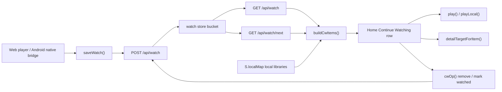

# Continue Watching Contract

Continue Watching is a product contract, not only a row on Home. It ties
watch-state persistence, source quality, TV next-up behavior, local-library
identity, Trakt imports, D-pad focus, and player resume together.

## Ownership Map

## Files To Review First

- `web/index.html`
  - `saveWatch()` writes resume position, duration, metadata, and
    `qualityRank`.
  - `loadWatchState()`, `buildCwItems()`, `continueWatchingIdentity()`,
    and `dedupeContinueWatchingItems()` build the Home row.
  - `cwOp()`, `homeFocusSnapshot()`, and `restoreHomeFocus()` keep row focus
    stable after remove/mark actions.
  - `epItemOf()`, `epTarget()`, `prepNextEpisode()`, and
    `prepPlayerSeasonEpisodes()` carry quality into remaining episodes.
- `server/index.js`
  - `watchRowsForProfileFromAll()` scopes rows by user/profile and merges
    Trakt fallback rows.
  - `watchSet` saves or removes one canonical watch key.
  - `nextWatchEpisodes()` creates server-side next-up suggestions and carries
    the saved `qualityRank`.
- `test/phase4.test.js`
  - Client contract checks for quality, dedupe, focus, details routing, and
    Up Next behavior.
- `test/security.test.js`
  - Server behavior checks for profile isolation, removal, and next-up payloads.

## Identity Rules

- Movies use `movie:<tmdbId>`.
- TV uses `tv:<tmdbId>` for every episode of the same show in the Home row.
  The row shows the most useful show card: active in-progress beats next-up,
  then the newest activity wins.
- When TMDB ids are missing, the row falls back to a cleaned title identity
  with common quality/source tags stripped so local-only `1080p` and `4K`
  copies do not create duplicate cards.
- Exact watch storage still stays episode-level:
  `tmdb:tv:<id>:s<season>e<episode>`. The show-level identity is only for the
  Home row merge.

## Quality Rules

- The selected source class is saved as `qualityRank` in watch metadata.
- `qualityRank` is title/show scoped through `qualityTitleKey()`, so a TV show
  selection applies to remaining episodes.
- Continue Watching cards, `/api/watch/next` next-up cards, the Up Next popup,
  and the player episode strip all carry that same rank.
- A 4K preference should request 4K sources first and must not silently fall
  back to a local 1080p file unless the user changes the quality choice or no
  quality preference exists.

## Focus Rules

- Remove/mark actions capture the action card before the request.
- After the server accepts the change, the local watch cache is updated first
  and Home is repainted with `watchReady: true`; it must not publish an empty
  placeholder row during a preserve-focus repaint.
- If the removed card is gone, focus lands on the nearest remaining card in the
  same row. It should not jump into Live TV unless the Continue Watching row no
  longer exists.

## Change Checklist

When changing Continue Watching, verify:

1. A movie watched in 4K resumes as 4K.
2. A show watched in 4K continues remaining episodes as 4K.
3. 4K and 1080p versions of the same movie/show do not appear as duplicate
   Home cards.
4. Removing a middle card keeps focus in Continue Watching near the removed
   position.
5. Details from a Continue Watching episode opens the show details page, while
   Resume plays the exact episode.
6. Trakt-imported progress still appears for every active profile without
   overwriting stronger local progress.
7. `npm.cmd test` passes after behavior changes.
