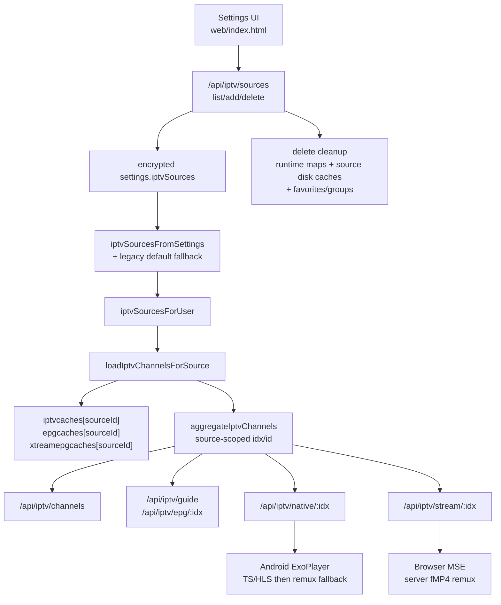

# Triboon Player Regression Map

This map exists to stop repeated fixes from drifting apart. Every playback fix
must update the contract, code paths, and verification row below before it is
called done. For multi-user VOD capacity, provider connection budgeting, and
read-ahead tuning, `docs-streaming-performance.md` is the detailed reference and
contract `P14` is the regression anchor.

## Live TV Source Topology

This is the required ownership path for IPTV fixes. Do not patch a playback path
without checking whether the problem belongs to source settings, per-source
caches, aggregate channel ids, guide lookup, browser remux, or Android native
playback.

IPTV fix checklist:

1. Confirm the source id is preserved from Settings to channel rows.
2. Confirm the channel id and group labels are source-scoped when more than one
   playlist is active.
3. Confirm delete removes runtime caches, persisted source caches, and
   source-prefixed favorites/groups.
4. Confirm web zapping closes the previous MSE fetch/remux before opening the
   next channel.
5. Confirm Android native zapping releases the previous ExoPlayer stream before
   opening the next provider URL.
6. Confirm provider errors are sanitized and do not log credential URLs.
7. Run `test/iptv-cache.test.js`; run `test/security.test.js` when routes,
   tokens, logging, or credentials are touched.

## Contracts

| ID | Contract | Code paths | Verification |
| --- | --- | --- | --- |
| P1 | VOD D-pad uses full player controls: Up arms seek-bar mode, Down returns to buttons, Left/Right move between visible buttons when the button row is active, and Left/Right scrub only from the seek bar/seek mode or the hidden video surface. When native ExoPlayer chrome auto-hides, logical focus parks back on the seek bar so the next hidden Down press reveals the button row with Play/Pause focused instead of opening episode rows or inheriting stale focus. Back follows TV-player convention: sheets close first, episode strip closes next, visible native controls hide next, and only a later Back leaves playback for the movie/show details page. Native remux/transcode seek must request a server-side remount even when ExoPlayer reports the current segment as non-seekable, and the native seek bar must stay focusable whenever `nativeCanSeekVod()` is true, including after auto-playing the next episode. User seek/skip is visually quiet: the full preparing loader is startup/failover-only, web remux/transcode source swaps hold the last rendered frame, and Android native remux/transcode seeks reuse the active ExoPlayer surface instead of releasing/recreating it. Live TV stays separate: Up/Down changes channels, and the visible chrome is for pause/guide/settings controls, not VOD seeking. | `android/app/src/main/java/app/triboon/tv/MainActivity.java` native chrome, `dispatchKeyEvent`, `onKeyDown`, `onKeyUp`, `nativeHideChrome`, `dismissNativeChromeForBack`, `parkNativeHiddenFocusOnSeek`, `moveNativeVerticalFocus`, `moveNativeControlFocus`, `handleNativeSeekBarKey`, `nativeCanSeekVod`, `nativeSeekBy`, `requestNativeVideoSeek`, `zapNativeLiveChannel`; `web/index.html` `seekTo`, `showSeekHoldFrame`, `hideSeekHoldFrame`, `startSource`, `__tvNativeVideoSeek`, `tryNativeVideoPlayer`; `bench/android-tv-smoke.ps1` | `test/phase4.test.js`, Android D-pad smoke |
| P2 | Live TV D-pad is channel-first: Up goes to next channel, Down goes to previous channel, and VOD-style seeking is hidden. Native Live TV must stamp web player state as `type: 'live'` before playback starts, or the zap callback has no safe channel list to use. Native Live TV chrome shows the channel title once in the bottom metadata bar, one `LIVE` badge on that same bar, and the clock alone in the top-right; it must not duplicate the source/title in the top-left or show another `LIVE` label in the seek row. | `MainActivity.java` `zapNativeLiveChannel`, `startNativePlayback`, `updateNativeChrome`, `web/index.html` `setNativeLivePlaybackState`, `tryNativeLivePlayer`, `__tvNativeLiveZap`, `zapChannel` | `test/phase4.test.js`, Live TV smoke |
| P3 | Native VOD timeline always has stable duration behavior. If ExoPlayer has not reported duration yet, the native player uses the web-side known duration until Exo catches up. Native remux/transcode handoff must declare `video/mp4` so ExoPlayer does not waste startup time sniffing fMP4 streams. Android playback capability claims must come from the native Exo/MediaCodec bridge and be merged into `/api/play` caps, not inferred from WebView alone. Those caps include RAM/device class and Dolby Vision support so Onn-class/low-memory Android TV boxes can be treated conservatively while Shield-class devices keep the faster profile. | `web/index.html` `clientCaps`, `nativePlaybackCaps`, `tryNativeVideoPlayer`, `nativeMimeForKind`; `MainActivity.java` `nativePlaybackCaps`, `buildNativePlaybackCaps`, `nativeTotalRamMb`, `nativeConservativePlaybackDevice`, `nativeKnownDurationMs`, `nativeDurationMs`, `updateNativeChrome`, `buildNativeMediaItem`; `server/index.js` `parseCaps`, `budgetAndroidTvCaps`, `playbackPolicyFor` | `test/phase4.test.js`, Android native seek smoke |
| P4 | Finished playback returns to the right detail page: movies return to movie details, episodes show Up Next when available, and final episodes return to show details. TV episode players show the show title with season/episode metadata as a separate subline. On Android native playback that episode subline belongs in the bottom-left metadata bar with the title, never in the top-left chrome. Up Next must appear before the episode ends on both web and native playback; native uses `__tvNativeVideoProgress` rather than waiting for ExoPlayer `STATE_ENDED`. Once Up Next appears, autoplay always gives a 10-second choice window before starting the next episode, including the ended fallback path. That popup must not start earlier than the 10-second choice window, because a 10-second countdown shown at 45 seconds remaining skips the end of the current episode. For D-pad episode playback, Down from the control row opens an animated current-season thumbnail strip with the current episode selected; cards show a larger borderless, rounded 16:9 still first and the episode name below it, not over the image. Left/Right changes episode focus, OK plays through the normal episode play path, Up/Back returns to controls, and Android native ExoPlayer receives the same episode choices through the web bridge. | `web/index.html` `openPlayer`, `episodePlayerMeta`, `updatePlayerMeta`, `getPlayerEpisodeContext`, `prepPlayerSeasonEpisodes`, `openPlayerEpisodes`, `activatePlayerEpisode`, `tryNativeVideoPlayer`, `__tvNativeEpisodeSelect`, `__tvNativeVideoProgress`, `__tvNativeVideoClosed`, `maybeShowUpNext`, `showUpNext`, `closePlayer`, `playbackFinishedDetailTarget`, `prepNextEpisode`; `android/app/src/main/java/app/triboon/tv/MainActivity.java` `nativePlaybackSubline`, `nativeChromeTitle`, `nativeChromeSubline`, `nativePlayerSubline`, `updateNativeEpisodeChoices`, `renderNativeEpisodeStrip`, `animateNativeEpisodeStripIn`, `animateNativeEpisodeStripOut`, `handleNativeEpisodeStripKey`, `startNativeProgress` | `test/phase4.test.js`, end-of-file smoke, Android D-pad episode-strip smoke |
| P5 | Resume is saved from every non-live entry point and honored by the player that opens: detail Play, Continue Watching, Sources, local library, native player, web player, quality switch, close, error, and ended. Android native direct playback must keep the requested start time pending until ExoPlayer reports the saved position. Android native remux/transcode playback must use the server-side `start=` URL and carry a display offset so watch saving, elapsed time, seeking, and finish handling stay in absolute movie time; remote seeks on those restarted streams remount the same native kind with a new `start=` instead of seeking inside the segment. Native VOD startup watchdogs are startup-only: once ExoPlayer has reached `STATE_READY`, normal mid-play buffering must not trigger fallback/remount/advance. If Exo reports `0` during an error/reset after real playback has progressed, the bridge must keep the last trustworthy movie position so fallback starts where the viewer was, not at the beginning. Trakt-linked users must export progress through `/scrobble/stop` with the Trakt app `/scrobble` permission enabled; failed exports are queued and retried by the normal sync tick before imports run. | `web/index.html` `resolvePlaybackResume`, `play`, `openSources`, `playLocal`, `saveWatch`, `stopActivePlaybackForReplacement`, `tryNativeVideoPlayer`, `applyNativeVideoProgress`, `__tvNativeVideoSeek`, `__tvNativeVideoError`; `android/app/src/main/java/app/triboon/tv/MainActivity.java` `nativePendingStartMs`, `nativeStartSeekIssuedAtMs`, `nativeStartOffsetMs`, `nativeDisplayPositionMs`, `nativeSeekToDisplayPosition`, `requestNativeVideoSeek`, `applyNativeStartSeekIfReady`, `updateNativeVideoWatchdog`, `safeNativeVideoPosSeconds`; `server/index.js` `/api/watch`, `/api/trakt/sync`, `/api/remux`, `/api/transcode`; `server/trakt.js` `scrobble`, `flushOutbox`, `_requestForOp` | `test/phase4.test.js`, `test/security.test.js`, Android resume/rebuffer smoke |
| P6 | Source selection picks the best correct release under the user cap, and Sources manual picks mount the exact selected release. Playback selection must not visibly trial-and-error unknown release containers: unknown inner filenames should start with the server remux path when ffmpeg is available. If Android ExoPlayer rejects a server-selected remux because the device cannot decode that codec, the same release may fall through to the server transcode URL before Triboon advances to a different release; it must not fall back to raw direct for that remux-selected source. Source scoring also receives the TMDB original language plus the user's preferred audio language: English/default titles demote foreign-only/dubbed releases, while non-English originals are allowed to prefer original-language or dual/multi-audio releases instead of forcing an English-only dub. Onn-class/low-memory Android TV 4K playback should prefer WEB-sized UHD sources and AAC/EAC3-friendly audio over huge remux/HD-audio defaults; the large remux remains available in Sources when the user explicitly chooses it. | `server/pipeline.js` `releaseMatches`, `Pipeline.search`, `Pipeline.play`; `server/scoring.js` `normalizeLanguageCode`, `releaseLanguageTag`, `scoreRelease`; `server/index.js` `playbackPolicyFor`, `budgetAndroidTvCaps`, `sourceDrawerCandidates`; `server/transcode.js` `decidePlayback`; `web/index.html` `sourceSearchQuery`, `play`, `nativePlaybackOrder` | `test/phase2.test.js`, `test/phase4.test.js`, `test/security.test.js`, Android source-quality stress |
| P7 | Startup must expose menu and home shell in under 1 second on Android TV. Watch state, TMDB catalog rows, libraries, watchlist, Live TV, and local indexing hydrate after first focus. Home must render a focusable placeholder before `/api/watch` can block first paint, prepare Continue Watching next-up entries during the watch-state publish path with a short deadline, coalesce unchanged row updates, preserve the current D-pad focus during background row refreshes, and defer catalog/enrichment repaint while the TV focus model or recent D-pad input is still settling. Continue Watching sorts the mixed resume/next-episode row by the last watched activity timestamp; next-up cards inherit the timestamp of the watched episode that produced them and never jump ahead only because they are next episodes. Android must buffer early D-pad keys until the web focus model reports ready. Empty home rows still need a focusable target so the remote never lands on a dead body focus. | `web/index.html` `enterAppShell`, `hydrateAppShellData`, `loadRows`, `prepareHomeTvNext`, `buildCwItems`, `compareContinueWatchingItems`, `publishHomeRows`, `homeRowsSignature`, `homeBackgroundRefreshReady`, `refreshHomeWhenSettled`, `homeRowsFromWatch`, `renderRows`, `restoreHomeFocus`, `signalTvReady`, `loadLibraries`, `enrichHome`; `server/index.js` `nextWatchEpisodes`; `android/app/src/main/java/app/triboon/tv/MainActivity.java` `pageTvReady`, `pendingTvKeys`, `appReady`, `jsKey`; `bench/android-tv-smoke.ps1` | `test/phase4.test.js`, `test/security.test.js`, authenticated UI smoke with boot timing |
| P8 | Live TV guide categories and rows must keep the focused item visible during fast D-pad repeats. Category columns are their own D-pad lane: Up/Down clamps inside categories, applies the highlighted category, and never spills into channels at the bottom; Right is the only category-to-channel handoff. In-player guide/PIP must use the same category-lane contract and open in a staged way: render/measure/sync the PiP slot first, then reveal the guide and native PiP without visible jumping. Opening the PiP guide from native movie/episode or Live TV playback must wake and clear the app screensaver before the WebView guide background is visible. Android native playback opens the native guide through the `TriboonTV.openGuide()` bridge instead of layering a web guide over ExoPlayer. If the WebView guide renderer crashes while ExoPlayer is in PiP, Android must promote playback back to fullscreen; a later normal Live TV selection must clear stale guide state and never inherit an old PiP layout. | `web/index.html` `renderLiveTvBody`, `focusLiveCategory`, `focusPlayerGuideCategory`, `renderPlayerGuideTimeline`, `togglePlayerGuide`, `scheduleNativeGuidePipSync`, `wakeScreensaverForPlayerSurface`, `revealNativeGuideShell`, `openNativeLiveGuideShell`, `tryNativeLivePlayer`, `playChannel`, guide key handler; `MainActivity.java` `openGuide`, `recoverWebRenderer`, `startNativePlayback`, `enterNativeGuideMode`, `enterNativeFullscreenMode`, `applyNativeGuidePipRect` | `test/phase4.test.js`, Live TV fast-scroll smoke, Android PiP guide smoke, `bench/android-tv-stress.ps1` |
| P9 | IPTV playback keeps web and Android paths separate: web Live TV consumes the server fMP4 remux through MediaSource, while Android TV uses ExoPlayer against provider-compatible native/proxy URLs. IPTV providers are first-class sources/playlists: each M3U or Xtream source owns its source id, channel cache, XMLTV cache, Xtream guide cache, source-scoped channel ids, favorites, and delete cleanup. Adding/removing/re-adding a playlist must start clean for that source without resurrecting stale channels from another source or from the old global cache; legacy single-playlist settings migrate through the `default` source only for compatibility. Changing web Live TV channels must close the prior MSE fetch/reader and server remux before opening the next channel, so zapping never stacks provider sessions or ffmpeg workers. Xtream native playback must prefer TS first and keep HLS as fallback, because real Xtream lines with TS playlists can start TS in under a second while HLS playlists often add multi-second startup and can trigger provider 403 behavior on event channels. Android native Live TV receives an ordered fallback ladder: provider TS/HLS first, then the server fMP4 remux path for Onn/Chromecast-class devices where raw provider streams stall or Exo extractors choke. That server remux fallback must also ingest the Xtream TS URL before HLS, matching the Shield-proven provider path and avoiding HLS-only 403 failures. Xtream channel lists are credential-free on disk, serve immediately after restart, and background guide/channel warmups pause while Live TV playback is active; visible guide/now-next requests may still run through the bounded Xtream EPG path so the PiP guide does not go blank during playback. If a persisted Xtream stream id goes stale and the provider returns 401/403/429, native proxy and server remux force-refresh the Xtream channel list, cache-bust the provider panel request, retry the same cleaned channel name before surfacing provider rejection, and cached provider failures must not short-circuit that forced refresh. Native Live TV keeps a short startup/rebuffer target so channel zaps show quickly, but low-power devices use slightly deeper startup/rebuffer buffers and a faster before-first-frame watchdog fallback. M3U/XMLTV support must handle very large provider playlists by stream-parsing to the channel cap instead of buffering the whole file, while keeping XMLTV matching by `tvg-id` and normalized channel name. Native IPTV proxy and browser remux requests use Triboon's smart-TV user agent, never leak credentials, sanitize provider failures, and short-cache provider-protection/rate-limit failures briefly while keeping true offline-channel cache longer. Successful finite native responses must explicitly end the downstream response and release the live slot. Browser Live TV clears the startup loader once a decoded frame exists, and provider HTTP failures show a provider-error panel instead of a misleading external-player prompt. Android surfaces the HTTP reason instead of a generic Exo source error. | `server/index.js` `iptvSourcesFromSettings`, `makeIptvSourceFromBody`, `clearIptvSourceRuntime`, `readIptvDiskCaches`, `loadIptvChannelsForSource`, `loadIptvChannels`, `scopeIptvChannels`, `aggregateIptvChannels`, `xtChannelUrls`, `hydrateXtreamCachedChannels`, `iptvPlaybackNameKey`, `xtreamPanelFetchOptions`, `refreshXtreamChannelForPlayback`, `fetchM3uChannelsStream`, `ensureXmltv`, `xtreamEpgList`, `epgNowNext`, `iptvGuide`, `warmIptvCaches`, `iptvNative`, `proxyIptvNative`, `iptvRemuxTargets`, `IPTV_NATIVE_PROXY_UA`, `iptvNativeLogLabel`, `iptvNativeFailureReason`, `iptvNativeFailureCacheTtl`, `sendIptvNativeError`, `iptvStream`; `web/index.html` `startLiveMseSource`, `showLiveProviderError`, `cleanupLiveMse`, `stopActivePlaybackForReplacement`, `playChannelWeb`, `openPlayer`, `tryNativeLivePlayer`, IPTV source settings UI; `MainActivity.java` native live fallback, `nativePlaybackErrorMessage`, `nativeLoadControlForMode`, `updateNativeLiveWatchdog` | `test/phase4.test.js`, `test/security.test.js`, `test/iptv-cache.test.js`, real Xtream + M3U/XMLTV playback/log check, Android native Live TV smoke, `bench/android-tv-stress.ps1` 20-zap run |
| P14 | Multi-user VOD performance is capacity-managed instead of connection-count-only. Provider limits are saved per account up to the current server cap, multiple usenet providers combine without losing their individual caps, and Settings -> Streaming performance owns expected users, remote users, quality mix, bandwidth, buffer targets, per-stream connection windows, and start/seek reserve. The recommendation flow must use the server-side provider list and return plain owner-facing guidance. NNTP scheduling must prioritize startup/seek work before playback, playback before health, and health before read-ahead. Playback read-ahead may grow when the server is idle, but it must shrink under active-user pressure so one large 4K stream cannot starve another user's first frame or seek. Health checks keep the bounded gate and background triage, but health/read-ahead work must not outrank the active segment being streamed. `docs-streaming-performance.md` is the canonical tuning/reference document; do not replace this with old fixed 16-connection or 8-12 read-ahead assumptions from historical benchmarks. | `server/index.js` `MAX_PROVIDER_CONNECTIONS`, `normalizeProviders`, `normalizeStreamingPerformance`, `recommendStreamingPerformance`, `streamingRuntimeProfile`, `/api/streaming/recommend`, provider settings; `server/pipeline.js` adaptive read-ahead and health probe count; `server/nntp.js` provider priority lanes and least-loaded provider ordering; `server/vfs.js` playback vs read-ahead priorities; `server/archive.js` health priority; `web/index.html` Streaming performance settings card; `docs-streaming-performance.md` | `test/security.test.js` streaming performance recommendation and high-connection provider round-trip; `test/e2e.test.js` NNTP priority queue; `test/phase2.test.js` pipeline/source regression; full `npm.cmd test`; multi-user playback stress |
| P10 | Browser and TV layouts keep posters visible and avoid backdrop takeover across common resolutions. Backdrop size is capped with viewport-aware `--bdW`/`--bdH` variables, Movies/TV/attached-library poster pages use the shorter `shortBrowseBd` backdrop, and phones hide the backdrop entirely. | `web/index.html` layout CSS, backdrop variables, `switchView`, row sizing | `test/phase4.test.js`, browser visual checks at 720p, 1080p, desktop, and mobile |
| P11 | Subtitles/CC must be selectable, visible, synced, and quiet across web and native playback. Captions must not auto-pop on playback start from the profile subtitle language or from native subtitle-choice refresh; only explicit per-title subtitle choices start enabled, and only the user-requested More subtitles path may reopen the native CC sheet after refreshed rows arrive. Web playback renders parsed cues itself with a time-scan fallback; native playback uses the online subtitle overlay and persists version/sync choices without restarting the video. Each language shows one clear Recommended row by default; alternate release/cut rows stay collapsed behind More subtitles, use source/cut/group labels, and must not show provider branding or generic "auto match" wording. The subtitle provider search must try exact mounted release/file hints (`release`, `origin`, `fileName`, `file`) first; if Wyzie rejects an over-specific release filter, retry ID-only and let local ranking still prefer exact file/release/cut matches before generic same-title rows. Edition is sync-critical: long cuts such as extended editions may be inferred from duration, but edition-tagged subtitle files must not auto-win for normal theatrical-looking releases. For TV episodes, online subtitle ranking must strongly prefer the exact SxxEyy/1x03 match and penalize wrong-episode rows. Native remux/transcode playback must compare subtitle cues against the display clock (`startOffset + player position`) so changing subtitles after resume/seek does not restart captions from episode time zero. Web and native CC sync controls expose one clean Later/Earlier pair; the current offset belongs in the heading/reset row, not duplicated across fine/coarse rows. | `web/index.html` `subtitleDefaultChoice`, `subtitleRecommendedLabel`, `subSyncHeadingLabel`, `setSubtitle`, `resolveOnlineSubtitleRel`, `applyTrackPrefs`, `applySubtitleTrack`, `nativeVideoSubtitleRel`, `activeSubtitleCues`, `renderSubCues`, `nativeSubtitleChoices`, `osSubUrl`; `android/app/src/main/java/app/triboon/tv/MainActivity.java` native subtitle overlay, `updateNativeSubtitleChoices`, `requestNativeSubtitleVersions`, `shiftNativeSubtitles`; `server/index.js` `/api/ossubs`; `server/opensubs.js` episode-aware ranking/download/version labels and Wyzie release/file search hints | `test/phase2.test.js`, `test/phase4.test.js`, `test/security.test.js`, `bench/android-tv-stress.ps1` subtitle probe, CC menu smoke, subtitle sync smoke |
| P12 | Attached local libraries must not slow first app load, rail rollover, or D-pad surfing. `/api/libraries` may load during shell hydration, but home must not fetch full `/api/libraries/:id/items` payloads; it may only reuse explicit library caches until a lean ownership endpoint exists. Rail rollover auto-loads the first bounded local-folder page through `/api/libraries/:id/items?limit=...`, and local library grids request more bounded pages through scroll/D-pad without rendering every scanned item at once. | `web/index.html` `loadLibraries`, `enrichHome`, `refreshLocalMapFromCachedLibraries`, `railPreviewAction`, `runLocalLibraryPaged`, `localLibraryPage`, `loadMoreLocalLibraryPage`, `mergeLocalItemsInto`, `focusGrid`; `server/index.js` `performScan`, `libraryItems`, `localItemPayload`, `localThumb` | `test/phase4.test.js`, `test/security.test.js`, Android boot smoke with perf marks, large local-library navigation smoke |
| P13 | Android TV Back must preserve app context before leaving Triboon. The native wrapper routes `KEYCODE_BACK`, Activity `onBackPressed`, and Android 13+ `OnBackInvoked` through the same system-back handler so platform Back cannot bypass the web `__tvBack()` contract. Settings/Preferences and other non-home pages return Home inside Triboon; Movies, TV Shows, and attached-library pages first open the section/menu rail from the current scroll/focus position; only root Home answers exit with the press-back-again toast. Dialogs, details, player, drawers, and track menus still close first through the normal Escape path. | `android/app/src/main/java/app/triboon/tv/MainActivity.java` `dispatchKeyEvent`, `onBackPressed`, `handleSystemBack`, `handleBack`; `web/index.html` `backToBrowseSectionMenu`, `__tvBack`, `enterRail`, `switchView` | `test/phase4.test.js`, Android TV Settings Back smoke, Android TV Back smoke from Movies/TV/library mid-grid |

## Change Rule

For any future player fix:

1. Identify the matching contract ID above.
2. Update the code paths listed for that contract.
3. Add or update the listed verification.
4. Run the verification before marking the issue done.
5. If the fix crosses contracts, update every affected row.
6. If the fix changes provider connections, read-ahead, startup reserves, health
   probes, or multi-user capacity, update `docs-streaming-performance.md` in the
   same change.

## Current Owner Requirements

- VOD and TV episodes use full D-pad controls: seek bar plus button row.
- Live TV Up means next channel and Down means previous channel.
- Menu and home shell must become usable in under 1 second.
- Finished movies return to movie details.
- Finished TV episodes play the next episode when available.
- A final TV episode returns to show details.
- Subtitles must not silently disappear: CC selection, version changes, sync changes, and turning subtitles off all need explicit regression coverage.
- Attached local libraries must hydrate after the shell is usable, auto-load a bounded first page from the rail, and request additional bounded pages so Android TV D-pad movement stays responsive in large folders.
- Movies, TV Shows, and attached-library pages must treat the first TV Back as "open this section menu," not "jump Home."
