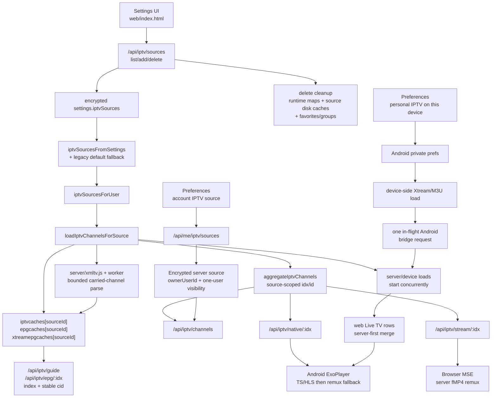

# Triboon Player Regression Map

This map exists to stop repeated fixes from drifting apart. Every playback fix
must update the contract, code paths, and verification row below before it is
called done. For multi-user VOD capacity, provider connection budgeting, and
read-ahead tuning, `docs-streaming-performance.md` is the detailed reference and
contract `P14` is the regression anchor.

## Live TV Source Topology

This is the required ownership path for IPTV fixes. Do not patch a playback path
without checking whether the problem belongs to source settings, per-source
caches, aggregate channel ids, guide lookup, browser remux, or Android native
playback.

IPTV fix checklist:

1. Confirm the source id is preserved from Settings to channel rows.
2. Confirm the channel id and group labels are source-scoped when more than one
   playlist is active.
3. Confirm delete removes runtime caches, persisted source caches, and
   source-prefixed favorites/groups.
4. Confirm web zapping closes the previous MSE fetch/remux before opening the
   next channel. Main, split, and Multiview surfaces must also reject stale
   hydration responses with independent monotonic tune epochs.
5. Confirm Android native zapping releases the previous ExoPlayer stream before
   opening the next provider URL.
6. Confirm provider errors are sanitized and do not log credential URLs.
7. Confirm server IPTV URL opens use the shared SSRF guard: Node fetches pin
   DNS with the validated lookup, and ffmpeg browser-remux receives a pinned IP
   URL plus original `Host` header with redirects disabled.
   Pinned-address failures in the native proxy must rotate to the next resolved
   address in the same request before surfacing a player-visible failure.
8. For account personal IPTV, confirm Preferences -> Live TV is discoverable
   before any playlist exists, browser clients can add/remove M3U or Xtream
   sources through `/api/me/iptv/sources`, the source is visible only to that
   user, and stream URLs bind both channel index and channel id.
9. For Android device-only IPTV, confirm "Save on this device only" appears
   only when the Android bridge exists. Confirm the source is encrypted in Android
   Keystore-backed private storage and device-local only: the server never
   receives credentials, favorites use local storage, Xtream and M3U channel
   rows plus guide rows reuse the encrypted 24-hour TV cache, XMLTV batch
   requests reuse one downloaded guide file, guide fetches skip negative/device
   channel indexes, and ExoPlayer/device subtitle fetches use pinned provider
   addresses with the original `Host` header. Hostname HTTPS device-local IPTV
   belongs in the server/account source path until the Android shell has a TLS
   pinning socket stack.
10. Confirm server/account and device-local channel loads begin concurrently,
    merge deterministically server-first, and concurrent callers join one
    Android bridge request rather than replacing its callback slot.
11. Confirm now/next and timeline guide memo/request keys bind each mutable
    channel index to its stable source-scoped id. Resolvable index drift must
    self-heal; an identity that disappeared returns 409 and reloads the lineup.
12. Confirm large XMLTV parsing runs in the bounded worker, retains only carried
    channels, keeps the HTTP/player event loop responsive, and can serve a valid
    stale cache while background refresh runs.
13. Confirm user and admin IPTV Settings show saved playlist status first and
   keep server/username/password fields collapsed until Add playlist is chosen.
   Saved playlists must be editable from the list. Edits reuse the same source
   id, keep saved sensitive fields when edit inputs are blank, clear that
   source's channel/guide cache, and never create a duplicate playlist.
14. Run `test/iptv-cache.test.js`, `test/xmltv.test.js`, and the focused
    `test/phase4.test.js` IPTV client-correctness test; run
    `test/security.test.js` when routes, tokens, logging, or credentials are
    touched.

## Contracts

### Live TV Player Controls And Multiview

- Web Live TV has its own player control personality. It hides VOD-only
  subtitle, audio-language, surround, and quality controls, then shows channel
  favorite in the player. Movie and episode playback must keep the full VOD
  control row unchanged.
- Multiview is launched from Live TV guide surfaces, not from the movie/show
  player chrome. The Live TV grid and the in-player Live TV guide expose a
  Multiview action that opens a separate viewing surface seeded with the current
  channel and an immediate picker for the next pane. Those launchers should stay
  icon-led and styled like the rest of the app chrome, while Multiview close
  controls use recognizable icon buttons instead of text-only pills. Android TV
  exposes the Multiview launchers in D-pad order, but enters the guarded
  WebView/server fMP4 surface only when MediaSource is available. Unsupported or
  direct calls fail closed before any browser pane is mounted; see the Android
  contract below.
- Browser Multiview uses the existing server fMP4 remux path with isolated
  MediaSource state per pane. It supports two, three, or four screens:
  two screens are side-by-side, three screens use one featured pane plus two
  smaller panes, and four screens use a 2x2 grid.
- Audio remains single-focus. D-pad left/right/up/down moves the highlighted
  pane according to the active layout, hover/focus also moves the active audio
  pane, and only that pane is audible. OK on an empty pane opens the picker. OK
  on a filled pane opens pane actions: Live TV panes show fullscreen/return,
  swap screen, change channel/title, and close screen; movie/show companion
  panes add Back 10s, Play/Pause, and Forward 30s before those actions. The
  change action opens the picker for that pane, so channel replacement is
  remote-first instead of add-only. The swap action enters a target-pick mode;
  choosing another visible screen swaps visual positions only, so a 3-screen
  secondary pane can become the featured pane without remounting either stream.
- Browser Multiview fullscreen is an internal zoomed-pane state, not the shared
  movie/show player or native fullscreen. The selected pane fills the Multiview
  surface without remounting streams; Back/Escape or the fullscreen action
  returns to the 2/3/4 grid.
- Multiview is capped at four screens. Each active pane can consume a provider
  stream, so higher layouts must be treated as a deliberate extra-stream choice.
  If one pane fails because a provider, source, or browser refuses the stream,
  that pane shows the failure while the other panes keep playing. Provider
  `429`/rate-limit failures must be explained as likely IPTV account stream
  limits, not as Triboon blocking the extra pane.
- The picker includes Continue Watching as a companion source. Browser
  Multiview may carry the currently playing movie/episode into the first pane or
  mount one Continue Watching movie/show into another pane through the normal
  source-selection path. Limit VOD companion playback to one pane until the
  capacity model accounts for extra NZB mounts, health gates, read-ahead,
  remux, and transcode work. VOD pane transport controls save progress like
  cleanup does; direct panes seek inside the video element, while remux and
  transcode panes rebuild that pane's playback URL at the requested timestamp
  instead of trying to seek inside the fMP4 segment.
- Favorites still follow the source-scoped P9 model: server/account channels use
  `/api/iptv/fav`, while Android device-local personal channels use local
  encrypted-device identity plus local favorites.
- Android normal Live TV remains native ExoPlayer-only, but Multiview is a
  deliberate separate surface. Android TV exposes the Live TV and PiP guide
  Multiview buttons in D-pad order, then enters the browser/server fMP4
  Multiview path only when that Android WebView reports MediaSource support.
  When Multiview is opened from active native playback, Android must first hide
  the ExoPlayer layer, restore WebView focus, and fire
  `__tvNativePlaybackSurfaceReady`; the web launcher waits for that callback
  before mounting panes. If MediaSource is unavailable, Multiview fails closed
  before mounting any pane.

#### Companion Screen Direction

- The long-term model can become a fuller universal companion screen after
  capacity accounting exists for multiple non-live panes. Live TV panes are
  bounded by provider streams and remux work; each VOD pane can create another
  NZB mount, health gate, read-ahead window, remux, or transcode.
- Longer-term Android Multiview can move to native Media3 surfaces with memory
  and decoder tests, but the current tested path is the explicit WebView fMP4
  surface entered from Multiview only.

### Episode Replacement Ownership

P4 handoffs are playback-scoped. Every browser media handler, asynchronous
subtitle preflight, and Android terminal/control callback must validate the
playback identity/token that opened it; queued work from the replaced episode
cannot close, seek, reconfigure, subtitle, or advance the new player. Rolling updates accept an older APK's zero-token
callback. A new APK using an older web shell must close its native surface
before revealing that shell's Up Next UI.

| ID | Contract | Code paths | Verification |
| --- | --- | --- | --- |
| P1 | VOD D-pad uses full player controls: Up arms seek-bar mode, Down returns to buttons, Left/Right move between visible buttons when the button row is active, and Left/Right scrub only from the seek bar/seek mode or the hidden video surface. Mobile web seeking must also be first-class: the seek bar has a 44px touch target, supports tap-and-drag pointer preview, and commits one quiet seek on release. The info/stats control is the last player button in both web and native order so CC/audio/quality/fullscreen stay grouped before diagnostics. When native ExoPlayer chrome auto-hides, logical focus parks back on the seek bar so the next hidden Down press reveals the button row with Play/Pause focused instead of opening episode rows or inheriting stale focus. Back follows TV-player convention: sheets close first, episode strip closes next, visible native controls hide next, and only a later Back leaves playback for the movie/show details page. Native remux/transcode seek must request a server-side remount even when ExoPlayer reports the current segment as non-seekable, and the native seek bar must stay focusable whenever `nativeCanSeekVod()` is true, including after auto-playing the next episode. User seek/skip is visually quiet: the full preparing loader is startup/failover-only, web remux/transcode source swaps hold the last rendered frame, and Android native remux/transcode seeks reuse the active ExoPlayer surface instead of releasing/recreating it. Live TV stays separate: Up/Down changes channels, and the visible chrome is for pause/guide/settings controls, not VOD seeking. Web and native players must expose a D-pad reachable stats button that shows basic support data without blocking playback: player path, quality, file/source label, movie/episode file size, position/buffer, video/audio format, dropped frames when available, and bandwidth/bitrate estimates in Mbps, not kbps. | `android/app/src/main/java/app/triboon/tv/MainActivity.java` native chrome, `dispatchKeyEvent`, `onKeyDown`, `onKeyUp`, `nativeHideChrome`, `dismissNativeChromeForBack`, `parkNativeHiddenFocusOnSeek`, `moveNativeVerticalFocus`, `moveNativeControlFocus`, `handleNativeSeekBarKey`, `nativeCanSeekVod`, `nativeSeekBy`, `requestNativeVideoSeek`, `zapNativeLiveChannel`, `showNativeStatsSheet`, `nativeStatsJson`; `web/index.html` `seekTo`, `beginSeekPointer`, `moveSeekPointer`, `endSeekPointer`, `showSeekHoldFrame`, `hideSeekHoldFrame`, `startSource`, `__tvNativeVideoSeek`, `__tvNativeVideoStats`, `collectPlayerStats`, `togglePlayerStats`, `tryNativeVideoPlayer`; `bench/android-tv-smoke.ps1` | `test/phase4.test.js`, Android D-pad smoke |
| P2 | Live TV D-pad is channel-first: Up goes to next channel, Down goes to previous channel, and VOD-style seeking is hidden. Native Live TV must stamp web player state as `type: 'live'` before playback starts, or the zap callback has no safe channel list to use. Native Live TV chrome shows the channel title once in the top-left player metadata cluster with one `LIVE` badge beside it, and the clock alone in the top-right; it must not duplicate the source/title in the bottom controls or show another `LIVE` label in the seek row. | `MainActivity.java` `zapNativeLiveChannel`, `startNativePlayback`, `updateNativeChrome`, `web/index.html` `setNativeLivePlaybackState`, `tryNativeLivePlayer`, `__tvNativeLiveZap`, `zapChannel` | `test/phase4.test.js`, Live TV smoke |
| P3 | Native VOD timeline always has stable duration behavior. If ExoPlayer has not reported duration yet, the native player uses the web-side known duration until Exo catches up. Native remux/transcode handoff must declare `video/mp4` so ExoPlayer does not waste startup time sniffing fMP4 streams. Android playback capability claims must come from the native Exo/MediaCodec bridge and be merged into `/api/play` caps, not inferred from WebView alone. Those caps include RAM/device class, Dolby Vision support, and real HDMI/ARC/eARC audio-output encodings (`ac3`, `eac3`, `eac3Joc`, `dts`, `dtsHd`, `truehd`, `passthrough`, `audioOutput`). Onn-class/low-memory Android TV boxes stay conservative even if a decoder is exposed; Shield-class/eARC-capable devices may direct-play compatible MKV TrueHD/Atmos/DTS-HD sources when the sink reports passthrough support. | `web/index.html` `clientCaps`, `nativePlaybackCaps`, `tryNativeVideoPlayer`, `nativeMimeForKind`; `MainActivity.java` `nativePlaybackCaps`, `buildNativePlaybackCaps`, `nativeAudioSinkCaps`, `nativePassthroughAudioDevice`, `nativeTotalRamMb`, `nativeConservativePlaybackDevice`, `nativeKnownDurationMs`, `nativeDurationMs`, `updateNativeChrome`, `buildNativeMediaItem`; `server/index.js` `parseCaps`, `budgetAndroidTvCaps`, `playbackPolicyFor`; `server/transcode.js` `decidePlayback`, `releaseLosslessAudioDirectOk`, `audioCopyOk` | `test/phase4.test.js`, Android native seek/audio-passthrough smoke |
| P4 | Finished playback returns to the right detail page: movies return to movie details, episodes show Up Next when available, and final episodes return to show details. TV episode players show the show title with season/episode metadata as a separate subline. On web and Android native playback, that title and episode subline belong in the top-left player metadata cluster beside the Back button; the bottom controls stay reserved for seek, playback buttons, episode strip, and sheets. Up Next must appear before the episode ends on both web and native playback; native uses `__tvNativeVideoProgress` rather than waiting for ExoPlayer `STATE_ENDED`. Once Up Next appears, autoplay gives a 10-second choice window in the final ten seconds. Reaching EOF completes that existing choice window: autoplay advances immediately unless dismissed and must never start a second post-EOF countdown. Manual Play Next, automatic next, and episode-strip selection are direct player-to-player replacements: the old frame or native loading surface remains topmost before local lookup/search/mount awaits, and the show detail page must never become visible between episodes. That popup must not start earlier than the 10-second choice window, because a 10-second countdown shown at 45 seconds remaining skips the end of the current episode. For D-pad episode playback, Down from the control row opens an animated current-season thumbnail strip with the current episode selected; cards show a larger borderless, rounded 16:9 still first and the episode name below it, not over the image. Left/Right changes episode focus, OK plays through the normal episode play path, Up/Back returns to controls, and Android native ExoPlayer receives the same episode choices through the web bridge. | `web/index.html` `beginPlaybackTransition`, `openPlayer`, `episodePlayerMeta`, `updatePlayerMeta`, `getPlayerEpisodeContext`, `prepPlayerSeasonEpisodes`, `openPlayerEpisodes`, `activatePlayerEpisode`, `tryNativeVideoPlayer`, `__tvNativeEpisodeSelect`, `__tvNativeVideoProgress`, `__tvNativeVideoEnded`, `finishEpisodeToNext`, `maybeShowUpNext`, `showUpNext`, `closePlayer`, `playbackFinishedDetailTarget`, `prepNextEpisode`; `android/app/src/main/java/app/triboon/tv/MainActivity.java` `nativePlaybackToken`, `nativePlaybackSubline`, `nativeChromeTitle`, `nativeChromeSubline`, `nativePlayerSubline`, `playNativeNextEpisode`, `updateNativeEpisodeChoices`, `renderNativeEpisodeStrip`, `animateNativeEpisodeStripIn`, `animateNativeEpisodeStripOut`, `handleNativeEpisodeStripKey`, `startNativeProgress` | `test/phase4.test.js`, end-of-file smoke, Android manual/autoplay no-detail-flash smoke, Android D-pad episode-strip smoke |
| P5 | Resume is saved from every non-live entry point and honored by the player that opens: detail Play, Continue Watching, Sources, local library, native player, web player, quality switch, close, error, and ended. Android native direct playback must keep the requested start time pending until ExoPlayer reports the saved position. Android native remux/transcode playback must use the server-side `start=` URL and carry a display offset so watch saving, elapsed time, seeking, and finish handling stay in absolute movie time; remote seeks on those restarted streams remount the same native kind with a new `start=` instead of seeking inside the segment. Native VOD startup watchdogs are startup-only: once ExoPlayer has reached `STATE_READY`, normal short mid-play buffering must not trigger fallback/remount/advance. Sustained post-start VOD stalls trim UI caches, then retry the same source and same playback kind at the current timestamp; they must not silently walk direct -> remux -> transcode -> next release in the middle of a movie or episode. If Exo reports `0` during an error/reset after real playback has progressed, the bridge must keep the last trustworthy movie position so recovery starts where the viewer was, not at the beginning. Trakt-linked users must export progress through `/scrobble/stop` with the Trakt app `/scrobble` permission enabled; failed exports are queued and retried by the normal sync tick before imports run. | `web/index.html` `resolvePlaybackResume`, `play`, `openSources`, `playLocal`, `saveWatch`, `stopActivePlaybackForReplacement`, `tryNativeVideoPlayer`, `applyNativeVideoProgress`, `__tvNativeVideoReady`, `__tvNativeVideoSeek`, `__tvNativeVideoError`, `recoverSamePlaybackSource`, `failover`, `autoAdvance`; `android/app/src/main/java/app/triboon/tv/MainActivity.java` `nativePendingStartMs`, `nativeStartSeekIssuedAtMs`, `nativeStartOffsetMs`, `nativeDisplayPositionMs`, `nativeSeekToDisplayPosition`, `requestNativeVideoSeek`, `applyNativeStartSeekIfReady`, `updateNativeVideoWatchdog`, `safeNativeVideoPosSeconds`, `nativeLoadControlForMode`; `server/index.js` `/api/watch`, `/api/trakt/sync`, `/api/remux`, `/api/transcode`; `server/trakt.js` `scrobble`, `flushOutbox`, `_requestForOp` | `test/phase4.test.js`, `test/security.test.js`, Android resume/rebuffer smoke |
| P6 | Source selection picks the best correct release under the user cap, and Sources manual picks mount the exact selected release. Playback selection must not visibly trial-and-error unknown release containers: unknown inner filenames should start with the server remux path when ffmpeg is available. If Android ExoPlayer rejects a server-selected remux because the device cannot decode that codec, the same release may fall through to the server transcode URL before Triboon advances to a different release; it must not fall back to raw direct for that remux-selected source. Source scoring also receives the TMDB original language plus the user's preferred audio language: English/default titles demote foreign-only/dubbed releases, while non-English originals are allowed to prefer original-language or dual/multi-audio releases instead of forcing an English-only dub. Onn-class/low-memory Android TV 4K playback should prefer WEB-sized UHD sources and AAC/EAC3-friendly audio over huge remux/HD-audio defaults; the large remux remains available in Sources when the user explicitly chooses it. Low-power Android TV and older Chromecast-class HD playback should prefer 1080p AVC/H.264 auto-picks when available, because exposed HEVC/AV1 decode support does not always mean fast startup, stable seeks, or reliable recovery on those boxes; HEVC/AV1 must still remain in fallback/manual source lists. Atmos/TrueHD/DTS-HD scoring is device-aware: lossless/Atmos remuxes get a meaningful boost only when the current native client reports matching passthrough caps, while browsers and budget devices prefer safer WEB-sized DDP sources. | `server/pipeline.js` `releaseMatches`, `Pipeline.search`, `Pipeline.play`; `server/scoring.js` `normalizeLanguageCode`, `releaseLanguageTag`, `scoreRelease`; `server/index.js` `playbackPolicyFor`, `budgetAndroidTvCaps`, `sourceDrawerCandidates`; `server/transcode.js` `decidePlayback`; `web/index.html` `sourceSearchQuery`, `play`, `nativePlaybackOrder` | `test/phase2.test.js`, `test/phase4.test.js`, `test/security.test.js`, Android source-quality stress |
| P7 | Startup must expose menu and home shell in under 1 second on Android TV. Watch state, TMDB catalog rows, libraries, watchlist, Live TV, and local indexing hydrate after first focus. Home must render a focusable placeholder before `/api/watch` can block first paint, prepare Continue Watching next-up entries during the watch-state publish path with a short deadline, coalesce unchanged row updates, preserve the current D-pad focus during background row refreshes, and defer catalog/enrichment repaint while the TV focus model or recent D-pad input is still settling. Continue Watching sorts the mixed resume/next-episode row by the last watched activity timestamp; next-up cards inherit the timestamp of the watched episode that produced them and never jump ahead only because they are next episodes. Android must buffer early D-pad keys until the web focus model reports ready. Empty home rows still need a focusable target so the remote never lands on a dead body focus. | `web/index.html` `enterAppShell`, `hydrateAppShellData`, `loadRows`, `prepareHomeTvNext`, `buildCwItems`, `compareContinueWatchingItems`, `publishHomeRows`, `homeRowsSignature`, `homeBackgroundRefreshReady`, `refreshHomeWhenSettled`, `homeRowsFromWatch`, `renderRows`, `restoreHomeFocus`, `signalTvReady`, `loadLibraries`, `enrichHome`; `server/index.js` `nextWatchEpisodes`; `android/app/src/main/java/app/triboon/tv/MainActivity.java` `pageTvReady`, `pendingTvKeys`, `appReady`, `jsKey`; `bench/android-tv-smoke.ps1` | `test/phase4.test.js`, `test/security.test.js`, authenticated UI smoke with boot timing |
| P8 | Live TV guide categories and rows must keep the focused item visible during fast D-pad repeats. Category columns are their own D-pad lane: Up/Down clamps inside categories, applies the highlighted category, and never spills into channels at the bottom; Right is the only category-to-channel handoff. In-player guide/PIP must use the same category-lane contract and open in a staged way: render/measure/sync the PiP slot first, then reveal the guide and native PiP without visible jumping. Opening the PiP guide from native movie/episode or Live TV playback must wake and clear the app screensaver before the WebView guide background is visible. Android native playback opens the native guide through the `TriboonTV.openGuide()` bridge instead of layering a web guide over ExoPlayer. If the WebView guide renderer crashes while ExoPlayer is in PiP, Android must promote playback back to fullscreen; a later normal Live TV selection must clear stale guide state and never inherit an old PiP layout. | `web/index.html` `renderLiveTvBody`, `focusLiveCategory`, `focusPlayerGuideCategory`, `renderPlayerGuideTimeline`, `togglePlayerGuide`, `scheduleNativeGuidePipSync`, `wakeScreensaverForPlayerSurface`, `revealNativeGuideShell`, `openNativeLiveGuideShell`, `tryNativeLivePlayer`, `playChannel`, guide key handler; `MainActivity.java` `openGuide`, `recoverWebRenderer`, `startNativePlayback`, `enterNativeGuideMode`, `enterNativeFullscreenMode`, `applyNativeGuidePipRect` | `test/phase4.test.js`, Live TV fast-scroll smoke, Android PiP guide smoke, `bench/android-tv-stress.ps1` |
| P9 | IPTV providers are first-class sources/playlists across server and device-local paths. Each M3U or Xtream source owns a stable source id, source-scoped channel ids, channel cache, Xtream guide cache, XMLTV cache, favorites, and cleanup. Add, edit, delete, and re-add flows must never mix stale channels from another source or the old global cache. Editing a playlist must update the existing source id, keep saved sensitive fields when the edit form leaves them blank, clear that source's channel/guide cache, and warm in the background. Server/account sources use `/api/iptv/sources` and `/api/me/iptv/sources`; Android device-only personal sources stay encrypted on the TV and reuse the same merge-by-id save path. Web Live TV consumes the server fMP4 remux through MediaSource and must not fall back to the generic external-player/VLC URL panel when MediaSource or the provider stream fails; it stays in the Triboon player and shows a live-specific unavailable state. Android TV/mobile normal single-channel playback uses ExoPlayer against provider-compatible native/proxy HLS or MPEG-TS URLs first, including source fallback candidates, and only then falls back inside ExoPlayer to the server fMP4 remux for devices/providers that cannot hold the native stream. Android shells must not call browser `playChannelWeb` for normal Live TV: if the APK bridge is stale or missing, the web app stops with an update/native-player message. Android Multiview is the explicit exception: its Live TV and PiP guide launchers are D-pad reachable and may enter the browser/server fMP4 Multiview surface only after a MediaSource support check. Channel changes must close the previous web fetch/remux and native live slot before opening the next provider URL. Server native proxy failures on a pinned resolved IP must retry the next validated address in the same request before requiring the user to hit Play again. | `server/index.js` `iptvSourcesFromSettings`, `makeIptvSourceFromBody`, `iptvEditBodyForExisting`, `cleanupEditedIptvSource`, `clearIptvSourceRuntime`, `readIptvDiskCaches`, `loadIptvChannelsForSource`, `aggregateIptvChannels`, `iptvNative`, `proxyIptvNative`, `iptvStream`; `web/index.html` `renderPrefPersonalIptv`, `editPersonalIptvFromPrefs`, `savePersonalIptvFromPrefs`, `editIptvSourceFromSettings`, IPTV source settings UI, `isTriboonAndroidShell`, `nativeLiveRequired`, `tryNativeLivePlayer`, `cleanupLiveMse`, `startLiveMseSource`, `showLiveProviderError`, `playChannelWeb`, `openMultiViewFromGuide`; `MainActivity.java` `savePersonalIptvSource`, `personalIptvGuide`, `loadPersonalIptvGuide`, `personalXtreamChannelCache`, `personalXmltvGuide`, native live fallback | `test/iptv-cache.test.js`, `test/security.test.js`, `test/phase4.test.js`, real Xtream + M3U/XMLTV playback/log check, Android native Live TV smoke, `bench/android-tv-stress.ps1` 20-zap run with Multiview launcher and PiP guide D-pad checks |
| P14 | Multi-user VOD performance is capacity-managed instead of connection-count-only. Provider limits are saved per account up to the current server cap, multiple usenet providers combine without losing their individual caps, and Settings -> Streaming performance owns expected users, remote users, quality mix, bandwidth, buffer targets, per-stream connection windows, and start/seek reserve. The recommendation flow must use the server-side provider list and return plain owner-facing guidance. NNTP scheduling must prioritize startup/seek work before playback, playback before health, and health before read-ahead. Playback read-ahead may grow when the server is idle, but it must shrink under active-user pressure so one large 4K stream cannot starve another user's first frame or seek. Decoded VFS cache retention is byte-capped as well as segment-capped because usenet article segment sizes vary by release; do not tune read-ahead without the byte budget. Detail-page source warmup must remain reusable by exact-id and TV-episode Play requests, including string-vs-number season/episode route values. `/api/prepare` may prepare only the stable detail Play target, may walk only a small capped ranked-source slice to skip a bad top pick, must expose no stream URL or play session, and Play must reuse or join the prepared/in-flight mount plus in-flight NZB prefetch instead of duplicating search, probe, mount, or health-gate work. TV playback must prepare the exact next episode once inside the final 90 seconds, warm/join its local-library lookup separately, and let manual/autoplay Play join that prepared or in-flight work without a second fan-out/NZB fetch/mount. Health checks keep the bounded gate and original background triage, but health/read-ahead work must not outrank the active segment being streamed. `docs-streaming-performance.md` is the canonical tuning/reference document; do not replace this with old fixed 16-connection or 8-12 read-ahead assumptions from historical benchmarks. | `server/index.js` `MAX_PROVIDER_CONNECTIONS`, `normalizeProviders`, `normalizeStreamingPerformance`, `recommendStreamingPerformance`, `streamingRuntimeProfile`, `/api/streaming/recommend`, `/api/prepare`, `/api/play`, provider settings; `server/pipeline.js` `Pipeline.search`, `Pipeline.prepare`, `prepareInflight`, adaptive read-ahead, source/NZB warmup reuse, and health probe count; `server/nntp.js` provider priority lanes and least-loaded provider ordering; `server/vfs.js` playback vs read-ahead priorities and decoded-cache byte cap; `server/archive.js` health priority; `web/index.html` `prefetchSources`, `preparePlaybackSource`, `prepNextEpisode`, `maybePrepareNextEpisode`, `playbackRequestBody`, Streaming performance settings card; `docs-streaming-performance.md` | `test/security.test.js` streaming performance recommendation, route coverage, and high-connection provider round-trip; `test/e2e.test.js` NNTP priority queue/cache byte cap; `test/phase2.test.js` pipeline/source warmup, fallback prepare reuse, and TV episode cache-key regression; `test/phase4.test.js` detail prepare/request-builder and near-end episode prepare contracts; full `npm.cmd test`; multi-user playback stress |
| P10 | Browser and TV layouts keep posters visible and avoid backdrop takeover across common resolutions. Backdrop size is capped with viewport-aware `--bdW`/`--bdH` variables, Movies/TV/attached-library poster pages use the shorter `shortBrowseBd` backdrop, and phones hide the backdrop entirely. | `web/index.html` layout CSS, backdrop variables, `switchView`, row sizing | `test/phase4.test.js`, browser visual checks at 720p, 1080p, desktop, and mobile |
| P11 | Subtitles/CC must be selectable, visible, synced, and quiet across web and native playback. Admin Settings owns whether built-in subtitles are enabled. Online subtitles are the default production path; built-in extraction is opt-in because embedded text extraction can scan much of a large media file and bitmap-only subtitle tracks cannot become WebVTT captions. When built-ins are off, web/native players must hide built-in/embedded/sidecar rows, skip built-in prewarm/extraction jobs, and go straight to online subtitles when online is configured. Web VOD CC should open even when the current release has no usable captions yet; the sheet must explain "built-in subtitles off in Settings" or online configuration state instead of leaving a dead gray CC button. Manual subtitle mode stays quiet at playback start unless the title has an explicit per-title subtitle choice. Automatic startup choices and automatic online fallback must not overwrite the per-title subtitle choice; only an explicit user CC menu choice may do that. Cue-less WebVTT must fail before it can enter the cache. Native subtitle-choice refresh must not reopen the CC sheet unless the user requested More subtitles. Web playback renders parsed cues itself with a time-scan fallback; Android native playback uses the Triboon subtitle overlay fed by server VTT URLs and persists version/sync choices without restarting the video. Each language shows one clear Recommended row by default; alternate release/cut rows stay collapsed behind More subtitles, use source/cut/group labels, and must not show provider branding or generic "auto match" wording. The subtitle provider search must try exact mounted release/file hints (`release`, `origin`, `fileName`, `file`) first; if Wyzie rejects an over-specific release filter, retry ID-only and let local ranking still prefer exact file/release/cut matches before generic same-title rows. Edition is sync-critical: long cuts such as extended editions may be inferred from duration, but edition-tagged subtitle files must not auto-win for normal theatrical-looking releases. For TV episodes, online subtitle ranking must strongly prefer the exact SxxEyy/1x03 match and penalize wrong-episode rows. Native remux/transcode playback must compare subtitle cues against the display clock (`startOffset + player position`) so changing subtitles after resume/seek does not restart captions from episode time zero. Web and native CC sync controls expose one clean Later/Earlier pair; the current offset belongs in the heading/reset row, not duplicated across fine/coarse rows. | `web/index.html` `builtInSubtitlesEnabled`, `playerCcCanOpen`, `openTrackMenu`, `startupSubtitleRelFor`, `applyStartupSubtitlePref`, `subtitleDefaultChoice`, `subtitleRecommendedLabel`, `subSyncHeadingLabel`, `setSubtitle`, `resolveOnlineSubtitleRel`, `applyTrackPrefs`, `applySubtitleTrack`, `nativeVideoSubtitleRel`, `activeSubtitleCues`, `renderSubCues`, `nativeSubtitleChoices`, `osSubUrl`; `android/app/src/main/java/app/triboon/tv/MainActivity.java` native subtitle overlay, `updateNativeSubtitleChoices`, `requestNativeSubtitleVersions`, `shiftNativeSubtitles`; `server/index.js` `/api/ossubs`, `/api/server`, `/api/settings`; `server/opensubs.js` episode-aware ranking/download/version labels and Wyzie release/file search hints | `test/phase2.test.js`, `test/phase4.test.js`, `test/security.test.js`, `bench/android-tv-stress.ps1` subtitle probe, CC menu smoke, subtitle sync smoke |
| P12 | Attached local libraries must not slow first app load, rail rollover, or D-pad surfing. `/api/libraries` may load during shell hydration, but home must not fetch full `/api/libraries/:id/items` payloads; it may only reuse explicit library caches until a lean ownership endpoint exists. Rail rollover auto-loads the first bounded local-folder page through `/api/libraries/:id/items?limit=...`, and local library grids request more bounded pages through scroll/D-pad without rendering every scanned item at once. Large scan results are indexed in `library.sqlite`; movie/episode playback lookups use `/api/libraries/local-lookup` on demand and must honor library user ACLs before minting any local stream/art/play URLs. | `web/index.html` `loadLibraries`, `enrichHome`, `refreshLocalMapFromCachedLibraries`, `fetchLocalPlaybackKeys`, `ensureLocalPlaybackForItem`, `railPreviewAction`, `runLocalLibraryPaged`, `localLibraryPage`, `loadMoreLocalLibraryPage`, `mergeLocalItemsInto`, `focusGrid`; `server/index.js` `performScan`, `saveLibraryScan`, `libraryItems`, `localLookup`, `localItemPayload`, `localThumb`; `server/library-db.js` | `test/phase4.test.js`, `test/security.test.js`, `test/library-db.test.js`, Android boot smoke with perf marks, large local-library navigation smoke |
| P13 | Android TV Back must preserve app context before leaving Triboon. The native wrapper routes `KEYCODE_BACK`, Activity `onBackPressed`, and Android 13+ `OnBackInvoked` through the same system-back handler so platform Back cannot bypass the web `__tvBack()` contract. Settings/Preferences and other non-home pages return Home inside Triboon; Movies, TV Shows, and attached-library pages first open the section/menu rail from the current scroll/focus position; only root Home answers exit with the press-back-again toast. Dialogs, details, player, drawers, and track menus still close first through the normal Escape path. | `android/app/src/main/java/app/triboon/tv/MainActivity.java` `dispatchKeyEvent`, `onBackPressed`, `handleSystemBack`, `handleBack`; `web/index.html` `backToBrowseSectionMenu`, `__tvBack`, `enterRail`, `switchView` | `test/phase4.test.js`, Android TV Settings Back smoke, Android TV Back smoke from Movies/TV/library mid-grid |

### Normative Contract Additions

These clauses are part of the named contract rows above and must travel with
them when the table is reorganized:

- **P5 - web rebuffer recovery.** After VOD has started, 45 seconds of
  `waiting` without meaningful position progress retries the same source,
  playback kind, and timestamp first. Playback/progress/seek/close cancels the
  watchdog. Code: `web/index.html` `armWebRebufferRecovery`,
  `clearWebRebufferRecovery`, `recoverSamePlaybackSource`. Verification:
  `test/phase4.test.js` `web VOD rebuffer and subtitle handoff...`.
- **P6 - exact season-pack payload.** Loose-file and RAR/ZIP packs require one
  exact requested `SxxEyy` payload before size, and the loose-pack STAT probe
  targets that same file; combined episode ranges count only when they cover the
  request. For collection-shaped names such as season packs and multi-episode
  ranges, missing, ambiguous, blocked, stub, or unstreamable selected members
  advance only the current request and do not poison sibling episodes. A
  selected loose-pack article or post-mount member failure is request-scoped;
  an archive first-volume failure remains release-wide because every member
  depends on that volume set. Exact single-episode releases still cache
  missing/blocked verdicts release-wide so later source walks skip them fast.
  Prepared, in-flight, and live
  mount reuse is keyed by NZB URL, season, episode, and audiobook mode, so one
  episode cannot reuse another payload. Season zero remains a real episode
  context for specials; it is not collapsed into the movie/default identity.
  Code: `server/pipeline.js` `wantedEpisodeOf`, `mountIdentity`,
  `firstProbeMsgId`; `server/archive.js` `pickInner`; `server/nzb.js`
  `episodeInName`, `pickPrimaryFile`. Verification: the pack-selection,
  probe/advance, and live-mount-reuse tests in `test/phase2.test.js` and
  `test/archive.test.js`.
- **P9 - last-intent Live TV.** Main, split, and each Multiview pane have
  independent tune epochs. Server/account and Android device lists load
  concurrently, merge server-first, and concurrent callers join one device
  bridge load. Now/next and timeline calls bind index plus stable `cid`; the
  server self-heals drift or returns 409 when the identity is gone. Same-source
  cold guide fanout joins one XMLTV fetch; headerless gzip is decoded under an
  expanded-size cap before the global two-wide carried-channel worker queue.
  Non-2xx, source edit/delete, and shutdown paths cannot publish an empty or
  stale cache. Code: `web/index.html`
  `beginLiveTune`, `liveTuneIsCurrent`, `loadPersonalIptvChannels`,
  `loadLiveChannelsCombined`, `fetchEpg`, `fetchGuideBatch`; `server/index.js`
  `iptvEpg`, `iptvGuide`, `fetchXmltv`; `server/xmltv.js`, `server/xmltv-worker.js`.
  Verification: `test/iptv-cache.test.js`, `test/xmltv.test.js`, and the IPTV
  client-correctness test in `test/phase4.test.js`.
- **P11 - bounded fast captions.** With built-ins off, web playback skips the
  optional 1.4-second track-probe wait before online subtitle warmup. The web
  overlay respects safe areas and a bounded height. Native receives S/M/L size,
  applies it to both Media3 embedded tracks and the online-caption overlay,
  cleans line-break tags/entities/markup, and renders no more than the last
  three overlapping cues. Code: `web/index.html` `startWebPlayerHousekeeping`,
  `#subOverlay`, native subtitle payload; `MainActivity.java` native overlay;
  `SubtitleText.java`. Verification: `test/phase4.test.js` plus
  `SubtitleTextTest.java` through `testDebugUnitTest`.
- **P14 - bounded cold-source hedge.** A pending top candidate gets one
  understudy after 800ms. Once a lower-ranked source is healthy, earlier ranks
  get 250ms final grace and no more candidates launch. Winner commit cancels
  every losing startup consumer before warmup; shared work is aborted only when
  no other joined play still needs it. Missing-probe and mount-deadline exits
  also abort the underlying BODY, and a later Play cannot join an already
  aborted prepare record. Auto-advance stays serial. Code:
  `server/pipeline.js` `RACE_HEDGE_MS`, `RACE_COMMIT_GRACE_MS`,
  `Pipeline._tryCandidate`, `Pipeline._advance`; `server/vfs.js`
  `NzbFileStream._fetchSegment`. Verification: the understudy, rank-grace,
  loser-cleanup, deadline/probe-cleanup, post-abort-join, and shared-consumer
  tests in `test/phase2.test.js`.
- **P14 - playback resource isolation.** Viewer fairness is driven only by real
  non-background `/api/stream` reads (plus a 120-second grace from range end),
  never by prepare/probe lifecycle touches; direct audiobook tracks use the same
  parent-mount lifecycle. Prepared mounts keep a bounded 4-read-ahead,
  96 MB/192 MB per-title window inside one 10%-RAM, 512 MB-capped aggregate pool
  and are promoted on their first player read. Grace expiry demotes stopped mounts
  and resizes survivors without waiting for another request; owner-cap/idle/overflow
  eviction excludes live readers even when their lifecycle timestamp is old. Multi-volume archives
  share one aggregate decoded-byte budget.
  Head/tail/resume warm jobs are tracked and cancellable on resume supersession,
  mount eviction, owner-cap trimming, denied-play cleanup, and shutdown without
  cancelling active playback consumers. Resume dedupe uses a short-lived byte
  interval and invalidates it on real cache-cap shrink. Code: `server/index.js` stream accounting
  and `releaseMountResources`; `server/pipeline.js` `mountHasActivePlayback`,
  `_applyPreparedWindow`, `_startPlaybackWarmup`, `cancelPlaybackWarmups`;
  `server/vfs.js` `SharedCacheBudget`; `server/archive.js` `mountNzb`.
  Verification: focused aggregate-cache, prepared-only, and cancellable-warmup
  tests in `test/e2e.test.js`, `test/phase2.test.js`, and the P14 stream-route
  contract in `test/security.test.js`.
- **P14 - cross-device 4K Continue Watching.** The durable title/show quality
  preference is separate from the current device's effective playback cap, so
  a browser's automatic 1080p ceiling cannot overwrite Android's later 4K
  request. Percent-only Trakt progress crosses the native bridge as
  `startFraction`: direct ExoPlayer seeks after duration resolves, while
  remux/transcode performs one token-guarded absolute remount. Native progress
  stays suppressed until the target stream is ready. Code: `web/index.html`
  `preferredQualityRankForItem`, `traktResumeFractionForItem`, and
  `__tvNativeVideoSeek`; `MainActivity.java` native percent-start lifecycle.
  Verification: the cross-device quality and native percent-resume regressions
  in `test/phase4.test.js`, plus the opt-in 4K resume controls in the Android
  stress/smoke helpers.
- **P14 - final Continue Watching checkpoints.** Web, native ExoPlayer,
  AirPlay/Cast, and Multiview VOD publish the exact latest position on pause,
  stop/Back, end/episode handoff, page teardown, and app background. Android
  pushes ExoPlayer's position before suspending WebView timers; final requests
  use `keepalive`, and duplicate lifecycle signals at the same point are
  coalesced so Trakt receives one scrobble. Code: `web/index.html`
  `saveWatch`, `flushPlaybackCheckpoints`, Cast callbacks, and Multiview save;
  `MainActivity.java` `onPause`. Verification: final-checkpoint and Android
  lifecycle contracts in `test/phase4.test.js`.
- **P14 - native media transport.** `MediaButtonReceiver` must resolve exactly
  one service; a cold Android 8+ media-button start performs the foreground
  handshake before dispatch and then stops when no music session exists.
  Hardware rewind/fast-forward targets active native VOD first and falls back to
  WebView audio. Verification: `test/phase4.test.js`, Android build/lint, and the
  emulator VOD-seek stress pass.

## Change Rule

For any future player fix:

1. Identify the matching contract ID above.
2. Update the code paths listed for that contract.
3. Add or update the listed verification.
4. Run the verification before marking the issue done.
5. If the fix crosses contracts, update every affected row.
6. If the fix changes provider connections, read-ahead, startup reserves, health
   probes, or multi-user capacity, update `docs-streaming-performance.md` in the
   same change.

## Current Owner Requirements

- VOD and TV episodes use full D-pad controls: seek bar plus button row.
- Live TV Up means next channel and Down means previous channel.
- Menu and home shell must become usable in under 1 second.
- Finished movies return to movie details.
- Finished TV episodes play the next episode when available.
- A final TV episode returns to show details.
- Subtitles must not silently disappear: CC selection, version changes, sync changes, and turning subtitles off all need explicit regression coverage.
- Rapid Live TV selection is last-intent-wins independently for the main player,
  split panes, and Multiview panes.
- A season-pack request must never mount or reuse a different episode.
- Sustained web VOD stalls must retry the same source before release failover.
- Native subtitle size and three-cue bounds must match the saved preference.
- Attached local libraries must hydrate after the shell is usable, auto-load a bounded first page from the rail, and request additional bounded pages so Android TV D-pad movement stays responsive in large folders.
- Movies, TV Shows, and attached-library pages must treat the first TV Back as "open this section menu," not "jump Home."
