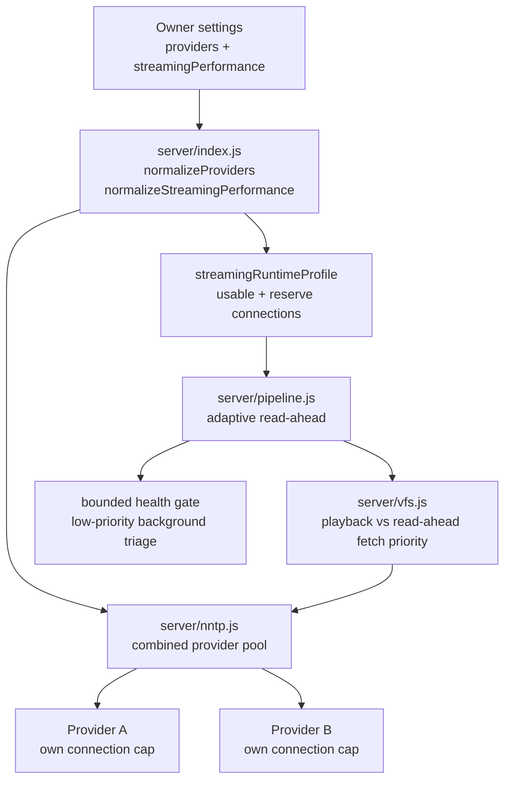

# Triboon Streaming Performance And Capacity Reference

This is the canonical reference for VOD startup, seek, read-ahead, usenet
connection budgeting, and multi-user capacity. Update this file whenever
provider limits, NNTP scheduling, playback buffering, source start behavior, or
the owner-facing Streaming performance settings change.

Related summaries live in `docs-architecture.md` and contract `P14` in
`docs-player-regression-map.md`. Those files should point back here instead of
redefining a different model.

## Product Goal

Triboon should feel fast even when several people press Play or seek at the
same time. The target behavior is:

- first frame starts quickly,
- seek/skip work jumps ahead of background work,
- one large 4K stream cannot starve another user's startup,
- health checks protect playback without blocking healthy releases,
- server owners can tune capacity without understanding NNTP internals.

The model is capacity-based, not "use every connection all the time."

## Owner Settings

Settings -> Streaming performance owns the capacity profile:

| Setting | Meaning | Runtime use |
| --- | --- | --- |
| Expected users | Simultaneous viewers to plan for | Divides available playback connections across active streams. |
| Remote users | Users outside the LAN | Drives upload warnings and quality-cap advice. |
| Stream mix | Mostly 1080p, mostly 4K, or mixed | Estimates bandwidth pressure and picks safer defaults. |
| Server download Mbps | Server-to-usenet download budget | Used by the recommendation flow; 80% is treated as safe usable capacity. |
| Server upload Mbps | Server-to-remote-user upload budget | Used for remote streaming warnings. |
| 1080p / 4K buffer targets | Owner-facing desired buffer ahead | Saved as seconds, translated into bounded article windows by the engine. |
| Per-stream 1080p / 4K connections | Maximum article window for one active stream | Caps read-ahead so a single stream does not monopolize the pool. |
| Startup reserve | Percentage of usable connections held back | Keeps new starts and seeks responsive. |

Provider connection limits are saved per usenet account and currently cap at
150. A 100-connection plan should be entered as 100; Triboon still decides how
many to use per stream.

## Runtime Flow



Source of truth in code:

| Area | File/function |
| --- | --- |
| Provider connection cap | `server/index.js` `MAX_PROVIDER_CONNECTIONS` |
| Provider normalization | `server/index.js` `normalizeProviders`, `providerConnections` |
| Capacity defaults and limits | `server/index.js` `normalizeStreamingPerformance` |
| Owner recommendation | `server/index.js` `recommendStreamingPerformance`, `POST /api/streaming/recommend` |
| Runtime profile | `server/index.js` `streamingRuntimeProfile`, `/api/status` |
| Pool construction | `server/index.js` `getPool` |
| Priority lanes and provider combining | `server/nntp.js` `ProviderPool`, `NntpPool` |
| Read-ahead and health gate | `server/pipeline.js` mount/play path |
| Segment fetch priority | `server/vfs.js`, `server/archive.js` |
| Settings UI | `web/index.html` Streaming performance card |

## Live TV Startup And Retune

Live TV has a separate rule from VOD: a silent or rejected provider channel must
fail quickly and release its socket, because the user is usually channel
surfing. The browser route (`/api/iptv/stream/:idx`) remuxes with ffmpeg for
web playback, while Android uses `/api/iptv/native/:idx` and ExoPlayer.

- Channel lists load as lean metadata first; playback URLs are minted only when
  the user presses Play.
- Browser remux prefers HLS when present, keeps one total first-byte startup
  deadline, and does not refresh huge Xtream playlists inside a failing player
  request.
- Native IPTV proxy has its own first-byte timeout and returns a clean player
  error instead of hanging forever.
- The local HTTP server disables socket reuse for app/player requests so
  cancelled playback cannot leave half-closed sockets that make the app look
  like it is "still waking up."

## Provider Combining

Multiple usenet accounts add capacity, but each account keeps its own
connection limit. `NntpPool` orders providers by current load:

```text
load = (busy connections + queued work) / provider connection cap
```

Healthy lower-load providers receive article work first. A provider with recent
connection failure is treated as down and tried last, but it is not removed
forever; the circuit breaker self-heals.

This means two accounts with 100 and 50 connections are modeled as 150 total
connections, not one account replacing the other.

## Priority Lanes

Provider work is scheduled by priority:

```text
startup / seek -> playback -> health -> readAhead -> background
```

Rules:

- startup and seek work must beat queued read-ahead,
- active playback bytes must beat health checks,
- health checks must beat background read-ahead,
- read-ahead may grow only when capacity exists.

If these priorities change, add or update a focused test in `test/e2e.test.js`.

## Read-Ahead Model

`buffer1080Sec` and `buffer4kSec` are owner-facing targets. The current engine
does not blindly download several minutes into a separate disk cache. Instead,
it converts capacity into a bounded article read-ahead window:

```text
activeMounts = mounts touched in the last 120 seconds + current mount
usable = floor(totalProviderConnections * 0.85)
reserve = ceil(usable * startupReservePct)
perStreamBudget = floor((usable - reserve) / activeMounts)
targetReadAhead = min(configured per-stream cap, perStreamBudget)
targetCache = max(targetReadAhead * 3, 36 or 48 segments)
targetCacheBytes = 48-96 MB for 1080p-class, 96-192 MB for 4K-class,
  divided down as active mounts increase
```

Large files use the 4K window; smaller files use the 1080p window.
The segment window decides how many decoded articles can stay hot; the byte
window is the hard memory guard. Do not tune one without the other: NNTP article
segments are not a fixed size, so a segment-only cache can be safe on one
release and dangerous on a large 4K remux.

This keeps hot streams buffered while preserving connection room for another
user's first frame or seek. A future disk-backed multi-minute buffer is allowed,
but it must preserve the same reserve and priority rules.

## Health Checks

The upfront health gate remains bounded. Healthy releases usually answer STAT
quickly; missing articles can take much longer. Triboon races triage against the
gate timer, records verdicts when available, and continues background triage at
lower priority.

Do not make health checks outrank active playback or startup. That turns
protection into the thing causing slowness.

## Recommendation Flow

`POST /api/streaming/recommend` is admin-only. It uses the saved provider list,
entered bandwidth, expected users, and stream mix to return:

- recommended owner settings,
- total provider connections,
- usable connections,
- reserve connections,
- playback connections,
- per-user connection budget,
- bandwidth warnings.

The recommendation is intentionally safe and deterministic. It is not a live
provider speed test. A future "run real speed test" button may be added, but it
must be clearly separate because it can create provider load and noisy results.

## Defaults And Limits

| Value | Current limit/default |
| --- | --- |
| Provider connections | 1-150 per account |
| Expected users | 1-50, default 4 |
| Remote users | 0-50, default 0 |
| 1080p buffer target | 30-600 sec, default 180 |
| 4K buffer target | 30-360 sec, default 90 |
| Startup reserve | 10-50%, default 25% |
| 1080p per-stream cap | 4-60 connections, default 12 |
| 4K per-stream cap | 6-80 connections, default 20 |
| Health probe limit | 2-12 probes, default 6 |

## When Changing This Area

Before changing performance behavior, check:

1. Provider settings still round-trip high connection counts.
2. Multiple providers keep individual caps and combine in capacity output.
3. Startup/seek work still outranks queued read-ahead.
4. Read-ahead and decoded-cache byte budgets shrink when active mounts increase.
5. Health probes remain bounded and lower priority than active playback.
6. `/api/status` and Settings show the same runtime profile.
7. Docs remain aligned: this file, `docs-architecture.md`, `docs-player-regression-map.md`, `README.md`, and `bench/RESULTS.md`.

Minimum verification:

```powershell
node --test test/e2e.test.js
node --test test/security.test.js
node --test test/phase2.test.js
npm.cmd test
git diff --check
```

For real production confidence, also run a multi-user playback stress pass with
several 1080p and 4K starts/seeks at once, while watching that a new start does
not wait behind background read-ahead.

## What Not To Reintroduce

- Do not hardcode "16 warm connections" as the runtime rule. That was a useful
  2026-06-10 Easynews benchmark, not the current capacity model.
- Do not let read-ahead use every provider connection.
- Do not cap playback cache by segment count alone; large 4K articles must have
  a decoded-byte budget too.
- Do not treat total provider connections as available playback connections;
  keep usable and reserve budgets.
- Do not add a server runtime npm dependency for this area without owner
  approval.
- Do not log provider credentials or credential-bearing article/source URLs.
