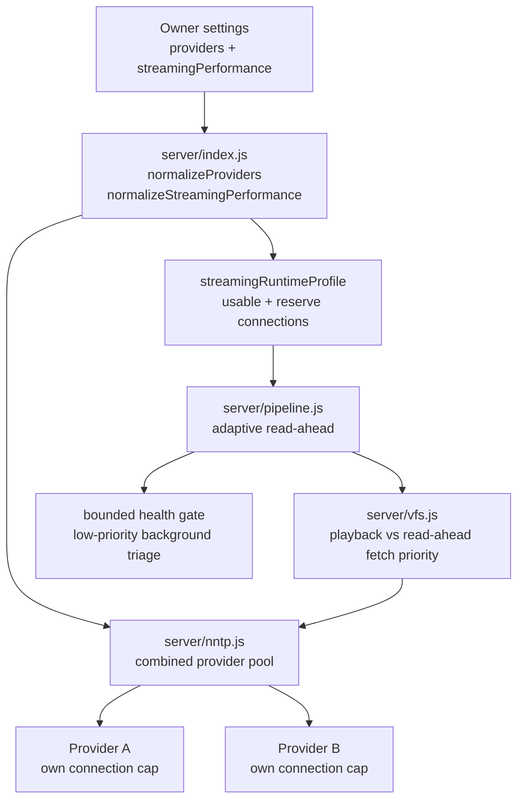

# Triboon Streaming Performance And Capacity Reference

This is the canonical reference for VOD startup, seek, read-ahead, usenet
connection budgeting, and multi-user capacity. Update this file whenever
provider limits, NNTP scheduling, playback buffering, source start behavior, or
the owner-facing Streaming performance settings change.

Related summaries live in `docs-architecture.md` and contract `P14` in
`docs-player-regression-map.md`. Those files should point back here instead of
redefining a different model.

## Product Goal

Triboon should feel fast even when several people press Play or seek at the
same time. The target behavior is:

- first frame starts quickly,
- seek/skip work jumps ahead of background work,
- one large 4K stream cannot starve another user's startup,
- health checks protect playback without blocking healthy releases,
- server owners can tune capacity without understanding NNTP internals.

The model is capacity-based, not "use every connection all the time."

## Owner Settings

Settings -> Streaming performance owns the capacity profile:

| Setting | Meaning | Runtime use |
| --- | --- | --- |
| Expected users | Simultaneous viewers to plan for | Divides available playback connections across active streams. |
| Remote users | Users outside the LAN | Drives upload warnings and quality-cap advice. |
| Stream mix | Mostly 1080p, mostly 4K, or mixed | Estimates bandwidth pressure and picks safer defaults. |
| Server download Mbps | Server-to-usenet download budget | Used by the recommendation flow; 80% is treated as safe usable capacity. |
| Server upload Mbps | Server-to-remote-user upload budget | Used for remote streaming warnings. |
| 1080p / 4K read-ahead goals | Owner-facing server-side read-ahead goal | Saved as seconds, translated into bounded article windows by the engine. |
| Per-stream 1080p / 4K connections | Maximum article window for one active stream | Caps read-ahead so a single stream does not monopolize the pool. |
| Startup reserve | Percentage of usable connections held back | Keeps new starts and seeks responsive. |

Provider connection limits are saved per usenet account and currently cap at
150. A 100-connection plan should be entered as 100; Triboon still decides how
many to use per stream.

## Runtime Flow



Source of truth in code:

| Area | File/function |
| --- | --- |
| Provider connection cap | `server/index.js` `MAX_PROVIDER_CONNECTIONS` |
| Provider normalization | `server/index.js` `normalizeProviders`, `providerConnections` |
| Capacity defaults and limits | `server/index.js` `normalizeStreamingPerformance` |
| Owner recommendation | `server/index.js` `recommendStreamingPerformance`, `POST /api/streaming/recommend` |
| Runtime profile | `server/index.js` `streamingRuntimeProfile`, `/api/status` |
| Pool construction | `server/index.js` `getPool` |
| Priority lanes and provider combining | `server/nntp.js` `ProviderPool`, `NntpPool` |
| Read-ahead and health gate | `server/pipeline.js` mount/play path |
| Segment fetch priority | `server/vfs.js`, `server/archive.js` |
| Settings UI | `web/index.html` Streaming performance card |

## Live TV Startup And Retune

Live TV has a separate rule from VOD: a silent or rejected provider channel must
fail quickly and release its socket, because the user is usually channel
surfing. The browser route (`/api/iptv/stream/:idx`) remuxes with ffmpeg for
web playback, while Android uses `/api/iptv/native/:idx` and ExoPlayer.

- Channel lists load as lean metadata first; playback URLs are minted only when
  the user presses Play.
- Browser remux prefers HLS when present, keeps one total first-byte startup
  deadline, and does not refresh huge Xtream playlists inside a failing player
  request.
- Native IPTV proxy has its own first-byte timeout and returns a clean player
  error instead of hanging forever.
- The local HTTP server disables socket reuse for app/player requests so
  cancelled playback cannot leave half-closed sockets that make the app look
  like it is "still waking up."

## Provider Combining

Multiple usenet accounts add capacity, but each account keeps its own
connection limit. `NntpPool` orders providers by current load:

```text
load = (busy connections + queued work) / provider connection cap
```

Healthy lower-load providers receive article work first. A provider with recent
connection failure is treated as down and tried last, but it is not removed
forever; the circuit breaker self-heals.

This means two accounts with 100 and 50 connections are modeled as 150 total
connections, not one account replacing the other.

**Circuit-breaker recovery (half-open probe).** A down provider does not stay
fully dark for the whole backoff window: while circuit-broken, `ProviderPool`
allows ONE throttled reconnect attempt (`reconnectProbeMs`, default 8s) so a
provider that has actually recovered rejoins within seconds instead of only
after the full `reconnectBackoffMs` (60s). A live connection clears the down
state; a failed probe refreshes the backoff. This matters most for
single-provider setups, where the down provider is the only option.

**Hedged multi-provider failover.** Failover is not purely exception-based.
For active-player BODY work (startup/seek/playback), if the chosen provider has
not answered within `HEDGE_MS_DEFAULT` (3s) — because its connections are queued,
or it went slow *after* the load sort — `NntpPool` speculatively starts the next
ordered provider too and takes whichever answers first, then aborts the loser.
So one slow provider costs ~3s, not the full 10s command timeout. A genuine
430 / connection error still advances immediately (no hedge wait). Only
active-player priorities hedge; background/health/read-ahead stay strictly
sequential so they never double-fetch. Hedging complements (does not replace)
load-based ordering and the per-provider single retry.

## Priority Lanes

Provider work is scheduled by priority:

```text
startup / seek -> playback -> health -> readAhead -> background
```

Rules:

- startup and seek work must beat queued read-ahead,
- active playback bytes must beat health checks,
- health checks must beat background read-ahead,
- read-ahead may grow only when capacity exists,
- cancelled readers must remove queued read-ahead and abort running BODY work
  when no other active reader still needs that article.

**Active-player connection reserve.** Queue priority alone is insufficient:
priority cannot preempt an in-flight BODY, so read-ahead (which can fan out up to
`maxConnPerStream` segments) was able to occupy *every* connection, forcing the
next-needed playback segment to wait for a read-ahead fetch to finish before it
got a socket — a multi-second head-of-line stall that drained the buffer and
caused "plays fine, then buffers every couple of minutes." `NntpPool._pump` now
holds back a small reserve (`playbackReserve`, default 2 for pools ≥ 4
connections, else 1, clamped to `size - 1`): read-ahead/background tasks may not
take the last `reserve` idle connections, while startup/seek/playback bypass the
reserve and may use the whole pool. This guarantees the active player a socket on
demand. Covered by `test/e2e.test.js` ("read-ahead never takes the last
connection").

If these priorities change, add or update a focused test in `test/e2e.test.js`.

## Read-Ahead Model

`buffer1080Sec` and `buffer4kSec` are owner-facing server read-ahead goals, not
a promise that the browser or ExoPlayer will show that many seconds in its
visible media buffer. The visible player buffer depends on the client decoder
and how aggressively it asks for byte ranges; it may be only a few seconds even
while Triboon has hot decoded articles ready server-side. The current engine
does not blindly download several minutes into a separate disk cache. Instead,
it converts capacity into a bounded article read-ahead window:

```text
activeMounts = mounts touched in the last 120 seconds + current mount
usable = floor(totalProviderConnections * 0.85)
reserve = ceil(usable * startupReservePct)
perStreamBudget = floor((usable - reserve) / activeMounts)
targetReadAhead = min(configured per-stream cap, perStreamBudget)
targetCache = max(targetReadAhead * 3, 36 or 48 segments)
targetCacheBytes = the owner buffer target (seconds) x the file's REAL average
  bitrate (size / probed duration; a sane per-class default before the probe lands),
  then divided down as active mounts increase
targetCacheSegments = high enough to retain targetCacheBytes for the mounted
  article size, not just readAhead * 3
```

The byte budget is sized from the file's actual bitrate, NOT a fixed assumption.
A high-bitrate 4K stream (Dolby Vision / HDR10+, ~60-90 Mbps) therefore gets a much
deeper buffer than a light WEB-DL, so the configured seconds-goal actually holds and
brief upstream latency spikes do not drain it (the old fixed 24 Mbps / 384 MB sizing
held only ~38s on an ~80 Mbps file and stalled every few minutes on a jittery line).
The 4K byte cap is ~1 GB but bounded to ~20% of system RAM so smaller self-hosted
boxes stay safe (they get a proportionally shallower buffer). Do not revert to a
fixed-bitrate byte budget without re-checking this latency behavior + the P14 contract.

**Head + tail warmup.** On mount commit (and on focus pre-mount), `_startPlaybackWarmup`
warms the cache at the low-priority read-ahead lane from BOTH ends: the head (96 MB for 4K
/ 32 MB for 1080p) and the tail (48 MB / 24 MB). The tail warm is essential, not optional:
the browser fMP4 remux (ffmpeg, fed over HTTP so it can Range-seek) and Android ExoPlayer
both parse the container index — mkv Cues / mp4 moov, which WEB-DL muxers place at the END
of the file — before they can stream. A cold tail turns each parse-seek into a multi-second
uncached fetch, so the remux trickles below the play bitrate for ~30 s and the player's
startup buffer drains ("plays fine, then buffers after a minute"). Measured live: warming
head+tail cut a 36 s / 21 Mbps cold remux start to <4 s / 240 Mbps. Covered by
`test/phase2.test.js` ("playback warmup pre-fetches BOTH the head and the tail").

**Resume-offset warmup.** A Continue Watching resume makes the player seek straight to a
deep mid-file byte offset that the head/tail warm never primed — on Android (native
ExoPlayer) that cold seek was a 20-30 s wait vs an instant fresh start, worst on big 4K
multi-volume RARs. `_startPlaybackWarmup` now takes a `resumeFrac` (resume seconds ÷
duration) and warms a window covering that offset on the SAME read-ahead lane + cache cap;
on a resume it warms only a small head (the head is not played, just parsed) so the budget
stays close to head+tail. The server cannot compute the offset itself (no track probe at
prepare/play), so the CLIENT — which knows the duration from watch state — sends `resumeFrac`
on `/api/play` and `/api/prepare` (so a focus pre-mount primes it before Play). It re-warms
once if the resume position changed, and simply does nothing when duration is unknown
(never a regression). Covered by `test/phase2.test.js` ("playback warmup warms the RESUME
byte window"). Like head+tail it must stay on the read-ahead lane and obey the cache cap.

Large files use the 4K window; smaller files use the 1080p window.
The segment window decides how many decoded articles can stay hot; the byte
window is the hard memory guard. Do not tune one without the other: NNTP article
segments are not a fixed size, so a segment-only cache can be safe on one
release and dangerous on a large 4K remux.

This keeps hot streams buffered while preserving connection room for another
user's first frame or seek. A future disk-backed multi-minute buffer is allowed,
but it must preserve the same reserve and priority rules.

Normal completed HTTP ranges keep their warm read-ahead alive. This matters for
Android ExoPlayer and browsers that request sequential ranges: treating every
completed range like a disconnect throws away the next hot articles and can make
4K playback rebuffer even when the provider is fast enough. True interrupted
requests still abort their queued/running read-ahead so a seek or closed player
does not keep pulling stale bytes.

If a VOD range is interrupted, the server destroys the response instead of
ending a shorter body under the original `Content-Length`. That lets the player
treat it as a retryable transport interruption rather than accepting a corrupt
partial range. VOD stream sockets also get a longer per-route timeout than the
general API timeout so a provider hiccup becomes buffering/retry behavior, not
an immediate truncated response.

Playback windows are applied when a mount is selected and rebalanced again when
stream routes are touched or housekeeping removes mounts. That lets existing
streams shrink their read-ahead/cache budget as additional users become active,
instead of keeping the larger window they received at mount time.

After a source mounts successfully, Triboon starts a bounded low-priority
playback warmup over the first chunk of the file. This is not allowed to block
Play, and it must stay on the read-ahead lane so player startup and seeks still
win. Its job is to surface slow early BODY articles while the player is opening
and to put the first 4K bytes into the VFS cache before ExoPlayer reaches them.
If playback later needs a segment that is already queued as read-ahead, the VFS
must upgrade that segment by issuing an urgent playback fetch rather than
waiting behind its own low-priority warmup.

The title detail page has one extra startup optimization: once the current Play
target is stable, the client asks `/api/prepare` to prepare the first viable
ranked source in the background. Prepare reuses the same search/NZB warming
path, walks only a small capped source slice to skip a bad top pick, mounts the
first winner, and records it in `mountByUrl` without creating a play session or
exposing a stream URL. A later Play still performs normal auth, policy, and
token creation, but the pipeline can reuse or join the live prepared/in-flight
mount instead of repeating source finding, first-article probe, mount, and
health gate. Fast home/card focus still uses cheap `/api/search` warming only;
it does not mount every title the user scrolls past.

Each active file also tracks coarse playback read pressure: segment waits,
maximum segment wait, cache hits, bytes served, and temporary adaptive
read-ahead boosts. A boost is allowed only after a real playback segment waits
past the drain threshold, expires automatically, and is capped by the same
streaming profile. The base window remains the fair-share value; adaptive
read-ahead may borrow only bounded spare reserve and must never exceed the
per-stream cap.

`/api/status` exposes aggregate pipeline and playback counters without release
names, NZB URLs, provider credentials, or stream tokens. Use those counters
before changing fan-out, probe, mount, health-gate, or read-ahead behavior.

Detail-page source warmup is part of the startup budget. A title-only warmup
can be reused by the later Play request once IMDb/TVDB ids arrive, because
release names are still verified against the wanted title/year/episode before
ranking. Warmed NZB downloads are joinable: if Play arrives while the top
candidate NZB is still downloading, it waits on that in-flight fetch instead of
starting a duplicate grab.

## Health Checks

The upfront health gate remains bounded. Healthy releases usually answer STAT
quickly; missing articles can take much longer. Triboon races triage against the
gate timer, records verdicts when available, and continues background triage at
lower priority. If the gate times out, the original triage continues in the
background; do not start a second health-probe batch for the same candidate.

Do not make health checks outrank active playback or startup. That turns
protection into the thing causing slowness.

## Recommendation Flow

`POST /api/streaming/recommend` is admin-only. It uses the saved provider list,
entered bandwidth, expected users, and stream mix to return:

- recommended owner settings,
- total provider connections,
- usable connections,
- reserve connections,
- playback connections,
- per-user connection budget,
- bandwidth warnings.

The recommendation is intentionally safe and deterministic. It is not a live
provider speed test. A future "run real speed test" button may be added, but it
must be clearly separate because it can create provider load and noisy results.

## Defaults And Limits

| Value | Current limit/default |
| --- | --- |
| Provider connections | 1-150 per account |
| Expected users | 1-50, default 4 |
| Remote users | 0-50, default 0 |
| 1080p read-ahead goal | 30-600 sec, default 180 |
| 4K read-ahead goal | 30-360 sec, default 90 |
| Startup reserve | 10-50%, default 25% |
| 1080p per-stream cap | 4-60 connections, default 12 |
| 4K per-stream cap | 6-80 connections, default 20 |
| Health probe limit | 2-12 probes, default 6 |

## When Changing This Area

Before changing performance behavior, check:

1. Provider settings still round-trip high connection counts.
2. Multiple providers keep individual caps and combine in capacity output.
3. Startup/seek work still outranks queued read-ahead.
4. Read-ahead and decoded-cache byte budgets shrink when active mounts increase.
5. Health probes remain bounded and lower priority than active playback.
6. `/api/status` and Settings show the same runtime profile.
7. Adaptive read-ahead stays capped by the streaming profile and decays after
   the stream recovers.
8. Docs remain aligned: this file, `docs-architecture.md`, `docs-player-regression-map.md`, `README.md`, and `bench/RESULTS.md`.

Minimum verification:

```powershell
node --test test/e2e.test.js
node --test test/security.test.js
node --test test/phase2.test.js
npm.cmd test
git diff --check
```

For real production confidence, also run a multi-user playback stress pass with
several 1080p and 4K starts/seeks at once, while watching that a new start does
not wait behind background read-ahead.

## What Not To Reintroduce

- Do not hardcode "16 warm connections" as the runtime rule. That was a useful
  2026-06-10 Easynews benchmark, not the current capacity model.
- Do not let read-ahead use every provider connection.
- Do not cap playback cache by segment count alone; large 4K articles must have
  a decoded-byte budget too.
- Do not treat total provider connections as available playback connections;
  keep usable and reserve budgets.
- Do not add a server runtime npm dependency for this area without owner
  approval.
- Do not log provider credentials or credential-bearing article/source URLs.
